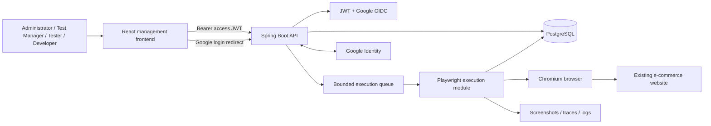

# TestOps Platform — Managed Browser Testing for an Existing E-commerce Application

> **Documentation status:** Milestones 1–5 are implemented as the current foundation; documentation is kept in sync with the source. Reporting, scheduling, notifications, and distributed execution remain planned.
>
> The repository contains the Milestone 1 runtime, the Milestone 2 identity foundation plus stabilization, the Milestone 3 project/test-definition management foundation, and the Milestone 4 queue/runner/web execution workflow. Dashboards, scheduled runs, distributed workers, full artifact retention, and live target probing remain intentionally deferred and are marked as future work in the deep documentation.

TestOps Platform is an internal web application for defining, executing, and reviewing automated browser tests against an existing e-commerce website. It gives administrators, test managers, developers, and testers one place to manage projects, test suites, reusable test cases, Playwright executions, failure evidence, and quality trends.

The difficult part is not opening a browser. The platform must preserve a trustworthy test history while definitions change, isolate browser sessions so tests do not contaminate each other, distinguish product failures from infrastructure failures, and keep authentication consistent across local email/password login and Google sign-in.

The existing e-commerce site is an **external system under test**. TestOps owns test definitions, execution state, results, screenshots, traces, users, permissions, and audit data. It does not own the target website’s deployment, database, inventory, accounts, selectors, or availability.

## Product status

The current implementation milestone provides:

- a Spring Boot 4.1.0 backend on Java 21;
- React/TypeScript/Vite frontend shell;
- PostgreSQL and Flyway wiring;
- a summary Actuator health endpoint;
- deterministic Playwright launch verification;
- Docker Compose services for `postgres`, `backend`, and `frontend`.
- canonical action/locator step editing with aggregate validation;
- asynchronous execution queue, in-process Chromium worker, result history, cancellation, and guarded screenshot/trace artifacts;
- project execution history and detail routes with polling.
- unified password/Google accounts, platform/project roles, effective project permissions, account security controls, administrator user management, and safe platform options discovery.

Milestone 3 adds authenticated project management, project membership, allowlisted target origins, masked/encrypted project variables, suites, cases, and ordered test steps. Secret variables remain disabled by default and require `PROJECT_SECRET_VARIABLES_ENABLED=true` plus a 32-byte key at `PROJECT_VARIABLE_KEY_PATH`.

Milestone 2 adds password registration with mandatory email OTP verification, TestOps JWT sessions, rotating refresh cookies, self-session revocation, and Google OIDC. Milestone 3 adds the management APIs and shell UI described above. Milestone 4 adds canonical executable steps, asynchronous suite/case execution, in-process Chromium workers, execution history, cancellation, screenshots, and the execution web workspace.

The intended first release covers:

- account registration and login using email and password (verified by sending OTP);
- Google sign-in through OAuth 2.0 and OpenID Connect;
- short-lived application JWT access tokens;
- rotating refresh tokens stored in secure `HttpOnly` cookies;
- global roles and project-level membership;
- project, test-suite, test-case, and ordered test-step management;
- asynchronous Playwright execution against the existing e-commerce application;
- screenshots and optional Playwright traces for failed or errored cases;
- execution history with functional and infrastructure outcomes kept separate;
- dashboard summaries, trends, filters, and recent failures;
- PostgreSQL persistence managed through Flyway migrations;
- Docker-based local runtime and GitHub Actions quality checks.

## Runtime shape



The browser client owns interaction state and displays server state. The Spring Boot application owns identity, authorization, durable data, execution orchestration, and result classification. Browser automation runs outside the initiating HTTP request and uses isolated Playwright browser contexts.

## Core capabilities

| Area | Product behavior |
|---|---|
| Authentication | Local email/password login and Google sign-in converge on the same local user, roles, refresh-token lifecycle, and JWT claims. |
| Projects | Define the target origin, ownership, membership, status, default browser policy, and test-data boundary. |
| Test suites | Group regression scenarios such as authentication, search, cart, checkout, and order confirmation. |
| Test cases | Store purpose, priority, preconditions, expected behavior, and ordered allowlisted browser steps. |
| Executions | Queue a suite, claim it through a bounded worker, run it asynchronously, and expose progress without holding the original request open. |
| Results | Preserve case and step snapshots, duration, failure classification, error evidence, and terminal execution state. |
| Artifacts | Store screenshots, traces, and logs outside PostgreSQL while keeping searchable metadata in the database. |
| Dashboard | Separate functional pass/fail trends from target, browser, network, and worker errors. |
| Administration | Manage accounts, status, roles, sessions, and project access. |

## Authentication model

### Email and password

1. The user submits an email address, display name, and password.
2. The backend creates an unverified account and sends a six-digit, ten-minute OTP through configured SMTP.
3. The user submits the OTP; only then does the backend issue a session.
4. Spring Security validates the verified account and BCrypt password hash on later login.
5. The backend issues a short-lived TestOps access JWT and rotating opaque refresh cookie.
6. The frontend keeps the short-lived access token in module memory only and sends it in the `Authorization` header.
7. On reload, the frontend calls the refresh endpoint to obtain a new access token; concurrent refreshes are deduplicated.

### Google

1. The browser enters the backend Google authorization route.
2. Spring Security performs the authorization-code/OpenID Connect flow.
3. The backend resolves the Google `sub` to a local TestOps account.
4. TestOps applies local roles and project permissions.
5. The backend creates the same refresh-token cookie used by password login.
6. The frontend exchanges that refresh session for a local TestOps access JWT.

Google proves identity. It does not define TestOps authorization, and Google access tokens are not accepted as TestOps API bearer tokens.

## Execution model

An execution request returns before Playwright finishes:

```text
POST execution request
        │
        ▼
Create QUEUED record
        │
        ▼
Return 202 Accepted
        │
        ▼
Worker claims execution
        │
        ▼
RUNNING → PASSED | FAILED | ERROR | CANCELLED
```

Outcome meanings:

- `PASSED`: every executable test case passed;
- `FAILED`: at least one product assertion failed;
- `ERROR`: browser, network, worker, test-data, target availability, or infrastructure prevented a trustworthy run;
- `CANCELLED`: the run was deliberately stopped;
- `SKIPPED`: a case was not executed because of policy or dependency.

This distinction prevents a target outage from being reported as a product regression.

## Technology baseline

The Milestone 1 foundation pins the following versions in its manifests, lockfile, images, and workflow:

| Layer | Intended stack |
|---|---|
| Frontend | React 19, TypeScript 5.9, Vite 8, React Router 7, TanStack Query 5 |
| Backend | Java 21, Spring Boot 4.1.0, Spring Web MVC, Spring Data JPA |
| Authentication | Implemented behind `AUTH_ENABLED`: password registration with mandatory email OTP, JWT resource-server validation, rotating refresh sessions, self-session revocation, and optional Google OpenID Connect |
| Database | PostgreSQL 18.4, Flyway |
| Browser automation | Playwright for Java 1.60.0, Chromium initially |
| Testing | JUnit 5, Spring Boot Test, Testcontainers 1.21.3, Vitest 4, React Testing Library |
| Packaging | Docker Compose, Node 24.17.0 build image, Nginx 1.30.3 runtime image |
| CI/CD | GitHub Actions |
| API documentation | OpenAPI API metadata is opt-in with `OPENAPI_ENABLED`; Swagger UI is not bundled |

Milestone 4 runs a bounded in-process worker, persists case/step results, exposes execution history/cancellation, and provides the first usable execution workspace. Scheduled runs, dashboards/trends, distributed workers, and full artifact retention remain future work.

## Why this shape

### Modular monolith first

Authentication, projects, test definitions, execution, artifacts, and reporting belong to one coherent product and one database. A modular monolith preserves feature boundaries without introducing distributed transactions, multiple deployment pipelines, or message-broker operations before the project needs them.

### Extractable execution boundary

The initial release can run a bounded Playwright worker inside the Spring Boot deployment. The execution package is kept independent so it can later become a separate worker process when browser memory, queue delay, or deployment interruptions justify it.

### Playwright instead of Selenium

The target is a modern e-commerce UI where auto-waiting, isolated browser contexts, user-facing locators, screenshots, traces, and deterministic browser packaging are more valuable than a large remote browser-grid matrix.

### PostgreSQL-backed history

Executions, refresh-token rotation, project membership, definition snapshots, and result filters require explicit constraints and reliable transactions. PostgreSQL also provides a practical path to multi-worker job claiming with `FOR UPDATE SKIP LOCKED`.

## Repository shape

```text
testops-platform/
├── .github/
│   └── workflows/
├── backend/
│   ├── src/main/java/.../
│   ├── src/main/resources/db/migration/
│   ├── src/test/
│   ├── pom.xml
│   └── Dockerfile
├── frontend/
│   ├── src/
│   ├── package.json
│   ├── package-lock.json
│   ├── Dockerfile
│   └── nginx.conf
├── docs/
│   ├── 01-technical-specification.md
│   ├── 02-authentication-and-security.md
│   ├── 03-data-model-api-and-workflows.md
│   ├── 04-operations-scaling-and-maintenance.md
│   ├── 05-risks-roadmap-and-decisions.md
│   └── assets/
├── artifacts/
├── scripts/
├── docker-compose.yml
├── .env.example
└── README.md
```

There is no `test-target/` application in this repository. The existing e-commerce website is the active system under test.

## Local run contract

The intended development entry point is:

```bash
cp postgres_db/.env.example postgres_db/.env
cp backend/.env.example backend/.env
cp frontend/.env.example frontend/.env
cp pgadmin4/.env.example pgadmin4/.env
docker compose up --build
```

For an authenticated local workflow, run `scripts/setup-local.ps1` (PowerShell) or `scripts/setup-local.sh` (POSIX shell) first. The scripts generate ignored RSA/crypto files and prompt for a local bootstrap-admin password; they do not reset database volumes or contact the target site. For a non-interactive local setup with password registration and Google enabled, use `scripts/setup-local.ps1 -Force -GenerateBootstrapPassword -EnableEmailDelivery -EnableGoogle` or `scripts/setup-local.sh --force --generate-bootstrap-password --enable-email-delivery --enable-google`. This preserves existing scoped `.env` files, merges the selected auth flags, and stores the generated bootstrap password only in `backend/.secrets/bootstrap-admin-password`.

Expected local surfaces:

| Surface | Intended URL |
|---|---|
| Management frontend | `http://localhost:3000` |
| Backend API | `http://localhost:8080` |
| Health | `http://localhost:8080/actuator/health` |

The Compose services are implemented in `docker-compose.yml`. PostgreSQL is the persistence service; the backend waits for its health check, and the frontend waits for the backend health check. PgAdmin is available at `http://localhost:5050` for local database inspection and persists its state in the `pgadmin4_data` volume. Authentication is disabled by default. To enable it, mount RSA PEM files, a 32-byte-or-longer OTP pepper, and (if bootstrap is enabled) a password file in `backend/.secrets/` using the paths documented in `backend/.env.example`, then provide SMTP and (optionally) Google values without committing them. Project APIs require authentication when enabled. Secret variables additionally require `PROJECT_SECRET_VARIABLES_ENABLED=true` and a 32-byte key at `PROJECT_VARIABLE_KEY_PATH`.

## Environment groups

- PostgreSQL connection and credentials;
- JWT issuer, audience, signing keys, and token lifetimes;
- refresh-cookie security settings;
- SMTP host, sender, and app-password configuration for email OTP delivery;
- OTP pepper and verification limits;
- Google client ID and secret; the callback path is derived from the exact frontend origin;
- Playwright worker count, queue capacity, browser, timeouts, and artifact policy;
- allowed frontend origin;
- artifact directory or object-storage configuration;
- approved e-commerce target origin;
- test-account or secret-variable references.

Never commit `.env`, JWT private keys, Google client secrets, access or refresh tokens, or target-site passwords.

## Documentation map

1. [Implementation handbook](docs/00-project-implementation-handbook.md) — start here for the idea, repository map, architecture, vocabulary, and a source-reading path.
2. [Backend code walkthrough](docs/07-backend-code-walkthrough.md) — Java/Spring syntax, configuration, authentication, project services, execution, Playwright, and tests.
3. [Frontend code walkthrough](docs/08-frontend-code-walkthrough.md) — React/TypeScript syntax, routing, auth bootstrap, API client, forms, queries, and polling.
4. [Database and runtime walkthrough](docs/09-database-and-runtime-walkthrough.md) — Flyway schema, PostgreSQL relationships, Compose, environment files, scripts, and CI.
5. [Executable step language](docs/10-executable-step-language.md) — case/step JSON shape, supported actions, locators, variables, URL safety, retries, and results.
6. [Technical specification](docs/01-technical-specification.md) — product boundary, architecture, domain model, UI, and design rationale.
7. [Authentication and security](docs/02-authentication-and-security.md) — JWT, refresh rotation, Google OIDC, authorization, secrets, and abuse controls.
8. [Data, API, and workflows](docs/03-data-model-api-and-workflows.md) — relational model, constraints, routes, state transitions, normal paths, and failure paths.
9. [Operations, scaling, and maintenance](docs/04-operations-scaling-and-maintenance.md) — local runtime, deployment, workers, queue ownership, observability, incidents, backups, and upgrade policy.
10. [Risks, roadmap, and decisions](docs/05-risks-roadmap-and-decisions.md) — explicit limitations, delivery sequence, alternatives, tradeoffs, and change-safety notes.
11. [Identity and authorization milestone](docs/06-milestone-5-identity-and-authorization.md) — unified accounts, platform/project roles, permissions, admin operations, and migration notes.

## Verification boundary

Before describing future product capabilities as implemented, inspect and reconcile:

- Maven and npm manifests and lockfiles;
- Spring and React entry points;
- route/controller mappings;
- security filters, JWT encoder/decoder, OAuth handlers, and role checks;
- JPA entities and Flyway migrations;
- Playwright runner, locator resolver, step interpreter, and artifact writer;
- `.env.example`, Dockerfiles, Compose, Nginx, and active Spring profiles;
- GitHub Actions;
- tests and build scripts;
- real UI screenshots and deployment URLs;
- target e-commerce routes, selectors, test data, and cleanup behavior.

Unknown implementation facts should remain marked `TODO: verify`, not converted into confident claims. Every implementation slice must update all related documentation before it is considered complete.
