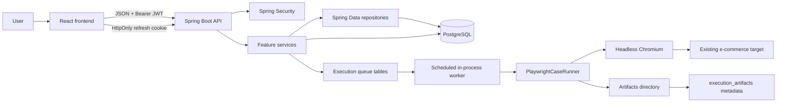

# TestOps Platform — Project Implementation Handbook

This is the starting point for understanding the project from the original idea down to the code that runs a browser step.

The repository already contains product and architecture documents. This handbook adds the missing “how do I read and understand the implementation?” layer. It is intentionally source-oriented: when a behavior is implemented, this guide points to the package, class, migration, or frontend module that implements it. When a capability is only planned, it is labelled as planned.

## 1. What the project is

TestOps is an internal platform for managing automated browser tests against an existing e-commerce application.

The product idea is:

```text
Define a test once → run it safely → store durable evidence → understand the result later
```

The platform is not the e-commerce application. The e-commerce application is the **system under test**. TestOps owns the test contract and the evidence around it:

| Owned by TestOps | External to TestOps |
| --- | --- |
| Users and login sessions | The target shop’s deployment |
| Platform and project permissions | The target shop’s database |
| Projects and target origins | Product inventory and order data |
| Suites, cases, and ordered steps | Target-site accounts and passwords |
| Queue and execution state | Target-site availability |
| Case/step outcomes | Target-site UI releases |
| Screenshots and Playwright traces | Payment provider behavior |

The core engineering problem is trust. A result should tell the truth about what happened. That leads to several important design choices:

1. Browser execution is asynchronous, so an HTTP request does not stay open while a browser runs.
2. Product failures and infrastructure errors are separate outcomes.
3. Target navigation is restricted to a project’s approved origin.
4. Browser contexts are isolated per case.
5. Refresh sessions are stateful and rotated so replay can be detected.
6. Database migrations, rather than automatic schema creation, own the PostgreSQL schema.

## 2. Current implementation boundary

The source currently contains the following implemented foundation:

- React 19 + TypeScript + Vite frontend.
- Spring Boot 4.1 + Java 21 backend.
- PostgreSQL persistence through Spring Data JPA and Flyway.
- Optional password authentication with email OTP verification.
- Optional Google OpenID Connect login.
- TestOps-issued RSA-signed JWT access tokens.
- Rotating opaque refresh tokens in `HttpOnly` cookies.
- Platform roles and project-scoped roles.
- Project, member, variable, suite, case, and ordered-step management.
- Asynchronous suite/case execution with a bounded in-process worker.
- Headless Chromium through Playwright for Java.
- Case/step result persistence and screenshot/trace artifact metadata.
- Docker Compose for PostgreSQL, backend, frontend, and PgAdmin.
- Frontend polling for execution progress.

The following are not yet the implemented product surface, even though the architecture documents describe them as future work:

- Reporting dashboards and historical trend calculations.
- Scheduled executions.
- Notifications.
- Distributed workers or a separate message broker.
- Object-storage-backed artifact retention.
- A broad cross-browser/OS certification matrix.
- A local copy of the e-commerce application.

## 3. The whole system in one picture



The direction of responsibility is deliberate:

- React displays state and collects input.
- The API validates input and identifies the user.
- Services apply business rules.
- Repositories load and save durable state.
- Entities represent database-backed state transitions.
- The worker coordinates long-running execution.
- Playwright performs browser actions.
- PostgreSQL is the durable authority for users, definitions, queue state, and results.

## 4. A normal user journey

### 4.1 Create and run a test

1. An administrator creates a project and chooses an approved target origin.
2. The project creator automatically receives the `PROJECT_MANAGER` membership.
3. A project manager or test manager creates a suite.
4. A test manager creates a case and supplies ordered steps.
5. The backend normalizes and validates the action and locator syntax.
6. The case is changed to `READY` once it is executable.
7. A project manager, test manager, or tester queues the suite or case with an idempotency key.
8. The API inserts a `QUEUED` execution and returns `202 Accepted`.
9. The scheduled worker claims the oldest queued execution.
10. The worker runs each case in a new Playwright browser context.
11. Case results and step results are persisted.
12. The frontend polls the execution endpoint every two seconds until the run is terminal.
13. A user opens the detail page and reads the distinction between passed, failed, error, or cancelled.

### 4.2 Authentication journey

For password login:

```text
POST /register
    → create user + BCrypt credential + hashed OTP
    → send email

POST /email/verify
    → verify OTP
    → issue access JWT + refresh cookie

POST /login
    → verify password/status/email verification
    → issue access JWT + refresh cookie

POST /refresh
    → lock current refresh row
    → mark it used
    → issue replacement refresh row + access JWT
```

For Google login, Google proves the external identity, but the backend still creates or resolves a local TestOps user and issues the same local TestOps JWT and refresh cookie.

## 5. Repository map

```text
testops-platform/
├── backend/
│   ├── src/main/java/com/megumi/testops/
│   │   ├── auth/              identity, sessions, roles, OAuth
│   │   ├── config/            typed application configuration
│   │   ├── execution/         queue, worker, Playwright, artifacts
│   │   ├── project/           projects, members, variables, definitions
│   │   ├── shared/            common API errors and platform options
│   │   └── TestopsApplication.java
│   ├── src/main/resources/
│   │   ├── application.yaml
│   │   └── db/migration/      ordered Flyway SQL files
│   ├── src/test/              unit and integration tests
│   ├── pom.xml                Maven build and dependencies
│   └── Dockerfile
├── frontend/
│   ├── src/app/               bootstrap, providers, router, top-level pages
│   ├── src/components/        shared shell components
│   ├── src/features/auth/     login, account, authentication context/API
│   ├── src/features/projects/ project and test-definition UI/API types
│   ├── src/features/executions/ execution history/detail UI
│   ├── src/features/system-health/ Actuator health panel
│   ├── src/lib/api.ts         fetch wrapper and access-token lifecycle
│   └── package.json
├── docs/                      product, security, data, operations, and code docs
├── scripts/                   local setup and verification scripts
├── docker-compose.yml         local multi-service runtime
├── artifacts/                 local artifact mount point
└── README.md                  project entry point
```

The backend is organized **by feature**, not by one global `controllers/`, `services/`, and `repositories/` directory. This keeps all pieces of authentication together and makes it easier to find the full implementation of a capability.

## 6. How to read one feature

When learning a feature, follow this sequence:

1. Start with the API controller to see the HTTP shape.
2. Read the DTO to see input and output fields.
3. Read the service to see business rules and transaction boundaries.
4. Read the repository to see the database query and locking behavior.
5. Read the entity to see state and domain mutations.
6. Read the Flyway migration to see the physical schema and database constraints.
7. Read the frontend API module to see the browser’s request shape.
8. Read the page/component to see how server state becomes UI.
9. Read the test to see which behavior the project treats as important.

For example, the execution feature can be read as:

```text
ExecutionController
  → ExecutionService
  → ExecutionClaimService / ExecutionRunService
  → ExecutionRepository / result repositories
  → ExecutionEntity / result entities
  → V011/V012 migrations
  → projectsApi + ExecutionPages
  → PlaywrightCaseRunner + ArtifactWriter
```

## 7. Important vocabulary

| Term | Meaning in this project |
| --- | --- |
| Project | A named target boundary plus its members, variables, suites, and cases. |
| Suite | A group of test cases that can be run together. |
| Case | One browser scenario with metadata and ordered executable steps. |
| Step | One action or assertion interpreted by `PlaywrightCaseRunner`. |
| Definition | Mutable project/suite/case/step configuration. |
| Execution | One queued or completed run of one case or suite. |
| Case result | The outcome of one case inside an execution. |
| Step result | Persisted status for one position in a case. |
| Artifact | A screenshot or trace stored on disk with database metadata. |
| Target origin | Scheme + host + optional port boundary for a project. |
| Platform role | Global `ADMIN` or `MEMBER`. |
| Project role | `PROJECT_MANAGER`, `TEST_MANAGER`, `TESTER`, or `VIEWER`. |
| Access token | Short-lived JWT kept in frontend memory. |
| Refresh token | Long-lived opaque value kept in an `HttpOnly` cookie and hashed in PostgreSQL. |

## 8. Design rules that explain many code decisions

### Controllers are thin

Controllers translate HTTP into typed method calls. They should not contain the full authorization, persistence, or browser logic. For example, [`ExecutionController`](../backend/src/main/java/com/megumi/testops/execution/api/ExecutionController.java) parses route values and delegates to [`ExecutionService`](../backend/src/main/java/com/megumi/testops/execution/service/ExecutionService.java).

### Services own business rules

Services answer questions such as:

- Is this user allowed to update this project?
- Is this case `READY`?
- Is the queue full?
- Is this refresh token still usable?
- Is this target origin in the allowlist?

### Repositories own persistence access

Spring Data repository interfaces describe queries and locks. They keep SQL/JPA access out of controllers and make concurrency behavior visible in one place.

### Entities own safe state changes

Methods such as `ProjectEntity.archive`, `ExecutionEntity.start`, and `RefreshTokenEntity.markUsed` make transitions explicit. Direct field mutation is avoided outside the entity.

### The frontend is a server-state client

React state is used for form fields and small UI states. TanStack Query owns cached server data, loading states, refetching, and invalidation. The frontend does not become an authorization authority; permissions returned by the server only control presentation.

### Migrations are append-only history

`V001__...sql` through `V014__...sql` show how the database evolved. Applied migrations must not be edited. A new schema change gets a new versioned SQL file.

## 9. Documentation path

Read the documents in this order:

1. This handbook — product idea, system map, vocabulary, and reading method.
2. [Backend code walkthrough](07-backend-code-walkthrough.md) — Java, Spring, authentication, project services, execution, and Playwright.
3. [Frontend code walkthrough](08-frontend-code-walkthrough.md) — React, TypeScript, routing, authentication bootstrap, queries, forms, and polling.
4. [Database and runtime walkthrough](09-database-and-runtime-walkthrough.md) — migrations, relationships, Compose, configuration, startup, and verification.
5. [Executable step language](10-executable-step-language.md) — the JSON/domain syntax for browser actions, locators, variables, and assertions.
6. [Technical specification](01-technical-specification.md) — product and architecture reference.
7. [Authentication and security](02-authentication-and-security.md) — security-specific reference.
8. [Data, API, and workflows](03-data-model-api-and-workflows.md) — relational/API reference.
9. [Operations, scaling, and maintenance](04-operations-scaling-and-maintenance.md) — operating the system.
10. [Risks, roadmap, and decisions](05-risks-roadmap-and-decisions.md) — tradeoffs and future work.
11. [Identity and authorization milestone](06-milestone-5-identity-and-authorization.md) — the current unified account and permission model.
12. [Product readiness milestone](11-milestone-6-product-readiness.md) — reporting, onboarding, sessions, and retention.
13. [Local target testing guide](12-local-target-testing-guide.md) — safe Docker-to-host browser testing.
14. [Guided local-target follow-ups](13-guided-local-target-follow-ups.md) — browser checks, metadata, builder behavior, and negative scenarios.
15. [Milestone 9 release candidate](14-milestone-9-release-candidate.md) — release gates, verification evidence, and publication boundaries.

## 10. The fastest way to verify your understanding

Pick one use case and trace it in both directions:

```text
User click
  → React handler
  → frontend API function
  → HTTP route
  → controller
  → service rule
  → repository query
  → entity mutation
  → PostgreSQL row
```

Then trace the response back:

```text
PostgreSQL row
  → JPA entity
  → service response DTO
  → JSON
  → typed frontend API result
  → TanStack Query cache
  → React render
```

If you can do that for login, creating a case, and queuing an execution, you understand the core of the project.
