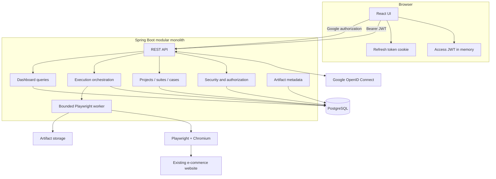
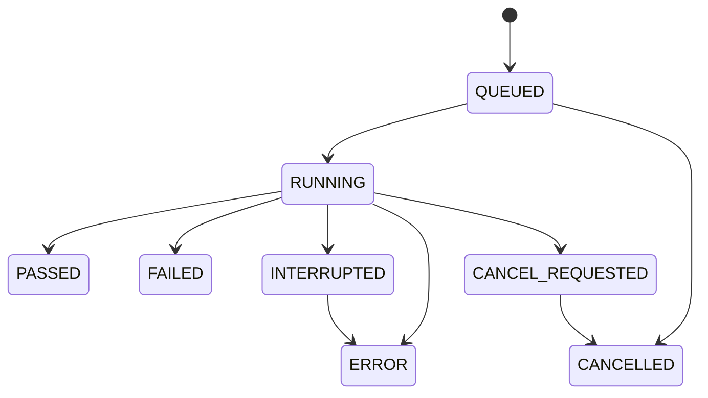

# Technical Specification

## 1. Product thesis

TestOps Platform is a managed browser-testing application for an existing e-commerce website. It exists to make automated regression work reviewable: users can define tests, run them without tying up an HTTP request, inspect why a case failed, and compare outcomes across time.

The central engineering problem is **trust**. A history page is useless if an old result silently reads today’s edited test definition. A dashboard is misleading if a browser crash counts as a product failure. A Google sign-in is unsafe if provider identity bypasses local roles. A scaling story is incomplete if two workers can claim the same checkout execution.

The design therefore centers on five boundaries:

1. identity provider versus local authorization;
2. management API versus browser execution;
3. mutable test definition versus immutable execution snapshot;
4. functional failure versus infrastructure error;
5. target application state versus TestOps-owned state.

## 2. Status and evidence boundary

This document is an implementation specification derived from the project outline and the agreed scaffold:

- React management frontend;
- Spring Boot modular monolith;
- PostgreSQL and Flyway;
- Playwright for Java;
- email/password login;
- Google OAuth 2.0/OpenID Connect;
- TestOps-issued JWT access tokens;
- secure rotating refresh tokens;
- Docker Compose;
- GitHub Actions;
- an existing e-commerce website as the system under test.

The project source was not attached. Exact names, versions, package paths, scripts, routes, migrations, indexes, and runtime behavior remain `TODO: verify`.

## 3. Users and responsibilities

| Actor | Main responsibility | Typical permissions |
|---|---|---|
| Administrator | Protect the platform and manage global access. | Manage users, roles, status, all projects, and global statistics. |
| Test manager | Own regression coverage for one or more projects. | Create projects, membership, suites, cases, steps, and executions. |
| Tester | Maintain and execute permitted tests. | Edit or run tests according to project membership; inspect evidence. |
| Developer | Run regressions and investigate failures. | View permitted projects, run approved suites, and inspect results. |

Global roles do not replace project membership. A `TEST_MANAGER` may manage only assigned projects unless the authorization policy explicitly grants broader access.

## 4. System boundary

### TestOps owns

- local user accounts;
- linked Google identities;
- global roles and project memberships;
- access-token signing and validation;
- refresh-token rotation and revocation;
- projects, suites, cases, steps, and variables;
- queued and running execution state;
- result snapshots;
- screenshots, traces, and logs;
- dashboard aggregates;
- audit events.

### TestOps does not own

- the e-commerce source repository;
- target deployment uptime;
- target inventory, orders, payments, and customer data;
- Google authentication infrastructure;
- Chromium upstream behavior;
- the correctness of selectors supplied by users.

Maintainers must not blur this boundary. A target outage should be recorded as an execution error, not rewritten as a failed business assertion.

## 5. Architecture



### Boundary explanations

The frontend owns form state, navigation, optimistic presentation, and polling. It does not decide whether a user may access a project.

The API owns validation and durable state. It returns `202 Accepted` when browser work is queued rather than waiting for completion.

The worker owns Playwright objects, browser contexts, step interpretation, screenshots, traces, and browser cleanup.

PostgreSQL owns queue state and execution truth. An in-memory executor may wake the first worker, but the database record remains the authority.

Artifact storage owns large bytes. PostgreSQL stores metadata, ownership, checksum, size, and retention data.

## 6. Deployment evolution

### Initial release

```text
React/Nginx container
Spring Boot container
  ├── REST API
  └── one bounded Playwright worker
PostgreSQL container
persistent artifact volume
```

This minimizes deployment complexity and is appropriate for a student project with controlled concurrency.

### Scale-ready shape

```text
React/Nginx
API instances
worker instances
PostgreSQL
object storage
reverse proxy / TLS
```

The same backend codebase can expose separate `api` and `worker` profiles. Extraction is justified only when browser memory, queue delay, fault isolation, or deployment interruption becomes measurable.

## 7. Repository architecture

### Root

```text
testops-platform/
├── .github/workflows/
├── backend/
├── frontend/
├── docs/
├── artifacts/
├── scripts/
├── docker-compose.yml
├── .env.example
├── .editorconfig
├── .gitattributes
├── .gitignore
└── README.md
```

### Backend package-by-feature

```text
com.example.testops/
├── auth/
│   ├── api/
│   ├── application/
│   ├── domain/
│   ├── infrastructure/
│   └── security/
├── user/
├── project/
├── testsuite/
├── testcase/
├── execution/
│   ├── api/
│   ├── application/
│   ├── domain/
│   ├── infrastructure/
│   └── runner/
├── artifact/
├── dashboard/
├── audit/
├── config/
└── shared/
```

Package-by-feature keeps business ownership visible. A project service should not become a generic bag of methods simply because every entity lives in a global `service` folder.

### Frontend by feature

```text
frontend/src/
├── app/
│   ├── router.tsx
│   ├── providers.tsx
│   └── queryClient.ts
├── features/
│   ├── auth/
│   ├── users/
│   ├── projects/
│   ├── test-suites/
│   ├── test-cases/
│   ├── executions/
│   └── dashboard/
├── components/
├── lib/
├── hooks/
├── types/
└── styles/
```

TanStack Query owns remote server state. React Hook Form and Zod own form state and client-side validation. Authorization remains a server concern even when the UI hides inaccessible actions.

## 8. Domain model

### User

A local TestOps principal.

Important state:

- stable UUID;
- normalized unique email;
- optional password hash;
- display name and optional avatar;
- email-verification status;
- account status: `ACTIVE`, `LOCKED`, `DISABLED`;
- creation, update, and last-login timestamps.

Rules:

- Google-only accounts may have no password hash;
- disabled or locked accounts cannot receive new tokens;
- role or password changes revoke refresh sessions;
- hard deletion is avoided when audit or execution ownership exists.

### OAuth account

Links a local user to a provider identity.

Key fields:

- provider: initially `GOOGLE`;
- provider subject: Google `sub`;
- provider email;
- local user ID;
- creation and last-login timestamps.

The provider subject is the durable identity key. Email is not sufficient because it may change.

### Role and project membership

Global roles:

- `ADMIN`;
- `TEST_MANAGER`;
- `MEMBER`.

Project roles:

- `OWNER`;
- `EDITOR`;
- `VIEWER`.

The exact role set is a policy decision. Keep it small until real permission differences appear.

### Project

Represents one testing boundary:

- name;
- description;
- approved target origin;
- status;
- membership;
- default timeout;
- browser policy;
- optional environment label such as `STAGING`.

Rules:

- archived projects reject new executions;
- navigation remains under an approved origin;
- historical results survive archive;
- project deletion is avoided after execution history exists.

### Test suite

Groups cases by business concern:

- authentication;
- product search;
- product details;
- cart;
- checkout validation;
- order confirmation.

Important fields:

- project;
- name;
- description;
- priority;
- enabled status;
- optional tags;
- optional execution order.

### Test case

Represents one expected behavior.

Important fields:

- suite;
- name;
- purpose and preconditions;
- priority;
- enabled status;
- retry policy;
- ordered steps;
- optional tags;
- optional data-isolation classification.

### Test step

A controlled Playwright instruction.

Initial actions:

- `NAVIGATE`;
- `CLICK`;
- `FILL`;
- `CLEAR`;
- `SELECT_OPTION`;
- `CHECK`;
- `UNCHECK`;
- `WAIT_VISIBLE`;
- `WAIT_HIDDEN`;
- `ASSERT_TEXT_EQUALS`;
- `ASSERT_TEXT_CONTAINS`;
- `ASSERT_VISIBLE`;
- `ASSERT_HIDDEN`;
- `ASSERT_URL_CONTAINS`;
- `TAKE_SCREENSHOT`.

Locator types:

- `ROLE`;
- `LABEL`;
- `TEST_ID`;
- `TEXT`;
- `PLACEHOLDER`;
- `ALT_TEXT`;
- `TITLE`;
- `CSS`;
- `XPATH`.

Arbitrary Java, JavaScript, shell, uploaded executables, or unrestricted network commands are outside the model.

### Project variable

A reusable value referenced from steps:

```text
${SHOP_TEST_EMAIL}
${SHOP_TEST_PASSWORD}
${DEFAULT_PRODUCT_NAME}
```

Secret variables are encrypted or injected from the environment, resolved only inside the worker, masked from API responses, and excluded from logs and snapshots.

### Execution

One request to run a suite or selected cases.

State model:



`INTERRUPTED` may be internal or persisted. It represents a worker that lost ownership before a trustworthy terminal outcome.

### Result and artifact

A case result preserves:

- execution;
- test-case ID;
- case-name snapshot;
- step-definition snapshot;
- target URL snapshot;
- browser details;
- status;
- timestamps and duration;
- error category and message;
- retry attempt;
- artifact references.

Artifact types:

- `FAILURE_SCREENSHOT`;
- `TRACE`;
- `VIDEO`;
- `CONSOLE_LOG`;
- `NETWORK_LOG`;
- `EXECUTION_LOG`.

The first release should create failure screenshots and optional traces. Video and network-body capture remain opt-in because of storage and privacy cost.

## 9. Playwright runner

### Thread ownership

Playwright Java objects are owned by one worker thread. A global Playwright instance is not shared concurrently.

```text
worker thread
├── Playwright
├── Browser
└── sequential BrowserContexts
```

Each independent test case receives a fresh `BrowserContext`, which isolates cookies, local storage, permissions, and session state.

### Lifecycle

```text
Claim execution
Start heartbeat
Create or reuse worker Browser
For each case:
    create BrowserContext
    create Page
    start trace when policy requires
    execute ordered steps
    save result
    capture evidence on failure/error
    close BrowserContext
Finalize execution
Stop heartbeat
```

Browser and context cleanup belongs in `finally` or `AutoCloseable` boundaries. A result must not remain `RUNNING` because evidence capture also failed.

### Step validation

Before opening a browser:

- action and locator combination is valid;
- required values exist;
- timeout is within policy;
- URL is relative to or allowed by the project origin;
- secrets are referenced rather than returned;
- destructive cases declare retry policy;
- maximum case/step limits are respected.

### Failure classification

| Event | Classification |
|---|---|
| Expected text differs | `FAILED` |
| Element expected visible is missing | `FAILED` |
| Browser cannot launch | `ERROR` |
| Target host cannot be reached | `ERROR` |
| Project variable cannot be resolved | `ERROR` |
| Worker loses database ownership | `ERROR` or `INTERRUPTED` |
| User cancels | `CANCELLED` |
| Prerequisite case failed and policy skips dependent case | `SKIPPED` |

## 10. Authentication architecture

Email/password and Google login converge on:

- one local user;
- local roles and memberships;
- a short-lived access JWT;
- a rotating opaque refresh token;
- the same logout and session-revocation behavior.

Access JWTs are held in frontend memory. Refresh tokens are held in secure `HttpOnly` cookies. Google tokens are not used to call TestOps APIs.

Detailed behavior is defined in [Authentication and security](02-authentication-and-security.md).

## 11. UI surface

### Public

- login;
- registration;
- Google sign-in;
- OAuth callback/error state;
- optional email verification;
- optional password reset.

### Authenticated

- dashboard;
- projects;
- project members;
- test suites;
- test cases;
- ordered step editor;
- execution queue/history;
- running execution detail;
- result and artifact viewer;
- profile and active sessions.

### Administrator

- user list;
- account status;
- global roles;
- security/session visibility;
- system-wide execution statistics.

### Important UI rules

- `FAILED` and `ERROR` use distinct wording and visual treatment;
- forms show server validation, not only client validation;
- execution polling stops at terminal state;
- stale execution pages can be refreshed safely;
- secret variable values are never rendered after save;
- role-based hiding is convenience, not security.

## 12. API behavior

The API uses `/api/v1` as the intended version prefix.

General rules:

- request DTOs are validated;
- JPA entities are not returned directly;
- list endpoints support pagination;
- filters are explicit;
- creation returns `201`;
- asynchronous execution creation returns `202`;
- duplicate or invalid transition returns `409`;
- permission failure returns `403`;
- missing authentication returns `401`;
- errors use a consistent problem-details shape.

Exact routes are documented in [Data, API, and workflows](03-data-model-api-and-workflows.md).

## 13. Testing strategy

### Backend unit tests

- status transitions;
- refresh-token rotation;
- JWT claims and validation;
- Google identity resolution;
- authorization policy;
- URL allowlisting;
- step validation;
- locator resolution;
- result aggregation;
- retry policy.

### Backend integration tests

Use PostgreSQL through Testcontainers:

- Flyway startup;
- registration/login/refresh/logout;
- project membership;
- CRUD and filtering;
- execution creation and atomic claim;
- artifact metadata;
- dashboard aggregation;
- concurrent refresh;
- concurrent worker claim.

### Runner tests

Run Playwright against a deterministic staging or local fixture environment. Normal pull-request CI should not depend on an unreliable public target.

### Frontend tests

- login and registration;
- refresh bootstrap;
- Google redirect;
- unauthorized handling;
- role-aware controls;
- test-step forms;
- execution polling;
- failure/error evidence;
- empty and error dashboard states.

## 14. Non-functional requirements

### Security

- no plaintext secrets;
- exact CORS origins;
- short access-token lifetime;
- rotating refresh tokens;
- target-origin allowlist;
- non-root containers;
- protected Swagger and health details in deployed environments;
- no public browser-debug port.

### Reliability

- execution ownership;
- heartbeat and stale-run recovery;
- bounded concurrency;
- browser cleanup;
- short database transactions;
- immutable migration history;
- persistent volumes;
- backups and restore testing.

### Maintainability

- package-by-feature;
- explicit state transitions;
- execution snapshots;
- centralized selectors or reusable target elements;
- consistent error contracts;
- decision log;
- source verification checklist.

### Performance

- paginated lists;
- indexed execution queries;
- aggregate dashboard queries;
- bounded artifact capture;
- configurable worker count;
- queue-age monitoring;
- no browser execution inside request threads.

## 15. Definition of done for the first release

- both login methods produce equivalent local authorization;
- access and refresh token lifecycles are tested;
- one project can store the existing e-commerce target;
- suites, cases, and allowlisted steps can be managed;
- a run returns `202`, transitions through queue state, and reaches a terminal result;
- each case is isolated in a new browser context;
- assertion failure and infrastructure error are distinguishable;
- failure screenshot is stored and authorized for viewing;
- history remains correct after a test definition is edited;
- Docker starts the intended runtime;
- CI validates frontend, backend, migrations, and image builds;
- README commands match the repository;
- no secret appears in Git, logs, API responses, or artifacts.
