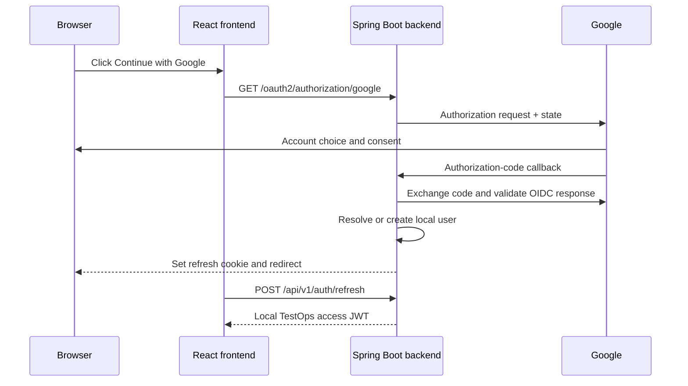

# Authentication and Security

## 1. Security thesis

TestOps supports two identity-entry paths but one authorization system. Email/password login and Google OpenID Connect both resolve a local user, local roles, project permissions, and a TestOps-issued access JWT.

The system fails its security boundary if:

- a Google token is accepted directly as a TestOps API token;
- email is treated as the durable Google identity key;
- a refresh token can be replayed without detection;
- disabling an account leaves long-lived credentials active;
- project authorization is enforced only in React;
- target-site passwords appear in test definitions or artifacts;
- the Playwright worker can browse arbitrary internal addresses.

## 2. Credential model

### Access token

Use a signed JWT for API access.

Recommended lifetime: 5–15 minutes; initial default 10 minutes.

Recommended claims:

| Claim | Purpose |
|---|---|
| `iss` | TestOps issuer. |
| `aud` | TestOps API audience. |
| `sub` | Stable local user UUID. |
| `jti` | Unique token identifier. |
| `iat` | Issue time. |
| `nbf` | Optional not-before time. |
| `exp` | Expiry. |
| `roles` | Global role codes. |
| `ver` | Optional user token version for stronger revocation. |

Do not include:

- passwords;
- Google access or refresh tokens;
- target credentials;
- private profile data that the API does not need;
- project secret values.

Prefer asymmetric signing:

- private key remains in the backend secret boundary;
- public key validates tokens;
- `kid` supports planned key rotation;
- previous public keys remain available until old access tokens expire.

`TODO: verify` signing algorithm, key format, and key-loading method in source.

### Refresh token

Use a random opaque token, not a self-contained JWT.

Recommended lifetime: 7–30 days; initial default 14 days.

Browser cookie:

```text
HttpOnly
Secure in HTTPS
SameSite=Lax
Path=/api/v1/auth
```

Database:

- store only a cryptographic hash;
- assign a token family;
- record issue, expiry, use, replacement, revocation, user agent, and IP;
- rotate on every successful refresh;
- revoke the family when reuse is detected.

### Frontend storage

- access JWT: memory only;
- refresh token: backend-controlled cookie;
- user profile: query cache, never an authorization authority.

Avoid `localStorage` and `sessionStorage` for refresh tokens.

## 3. Password account flow

### Registration

Normal path:

1. normalize the email;
2. validate email, display name, and password policy;
3. reject an existing active account;
4. hash the password with an adaptive `PasswordEncoder`;
5. create the local user and default role;
6. optionally require email verification;
7. create an audit event;
8. issue tokens only if the account is allowed to sign in.

Failure path:

- field errors return structured validation;
- duplicate email returns `409 Conflict`;
- password never appears in logs;
- token creation occurs only after user persistence succeeds;
- verification-required accounts do not silently receive full access.

### Login

```http
POST /api/v1/auth/login
Content-Type: application/json

{
  "email": "tester@example.com",
  "password": "********"
}
```

Success:

```http
HTTP/1.1 200 OK
Set-Cookie: refresh_token=<opaque>; HttpOnly; Secure; SameSite=Lax; Path=/api/v1/auth
```

```json
{
  "accessToken": "<jwt>",
  "tokenType": "Bearer",
  "expiresIn": 600,
  "user": {
    "id": "local-user-uuid",
    "email": "tester@example.com",
    "displayName": "Test User",
    "roles": ["MEMBER"]
  }
}
```

Failure:

```json
{
  "type": "https://testops.example/problems/invalid-credentials",
  "title": "Authentication failed",
  "status": 401,
  "detail": "The email or password is incorrect."
}
```

Wrong password and unknown email use the same public response.

### Password storage

Use an adaptive one-way hash through Spring Security, such as bcrypt or Argon2 behind `DelegatingPasswordEncoder`.

Requirements:

- no reversible encryption;
- no raw SHA/MD5 password storage;
- configurable work factor;
- future algorithm upgrades;
- password reset and change revoke refresh-token families;
- account lock/throttling policy for repeated failures.

## 4. Google OpenID Connect

### Scopes

Request only:

```text
openid
profile
email
```

Do not request Google API scopes when the project only needs identity.

### Sequence



Tokens are not placed in the redirect URL.

### Identity resolution

1. Find `oauth_accounts` by `(GOOGLE, sub)`.
2. If found, authenticate the linked active local user.
3. If not found and no local user owns the verified email, create a local account and provider link.
4. If a password account owns the email, require explicit recent-authentication confirmation before linking.
5. Never use email as the returning provider key.
6. Validate expected issuer, audience, state, nonce behavior, and required claims.

### Provider failure

- denied consent returns to a stable login error page;
- invalid state fails closed;
- missing `sub` fails closed;
- Google outage prevents new Google login but does not invalidate existing TestOps JWTs;
- provider error data is not exposed verbatim to the user;
- Google tokens are not stored unless a future feature requires a Google API.

### Google-only users

A Google-only account may have `password_hash = NULL`.

Adding a password requires:

- a recent authenticated session;
- password policy;
- secure hash;
- refresh-session revocation;
- audit event.

Unlink Google only when another login method remains.

## 5. Refresh-token rotation

### Proposed table

```text
refresh_tokens
- id UUID
- user_id UUID
- family_id UUID
- token_hash VARCHAR UNIQUE
- issued_at TIMESTAMPTZ
- expires_at TIMESTAMPTZ
- used_at TIMESTAMPTZ NULL
- revoked_at TIMESTAMPTZ NULL
- revocation_reason VARCHAR NULL
- replaced_by_token_id UUID NULL
- user_agent VARCHAR NULL
- created_ip VARCHAR/INET NULL
```

### Atomic rotation

Within one short transaction:

1. hash the presented token;
2. lock or atomically update the matching record;
3. reject expired, revoked, or already-used state;
4. verify the local user remains active;
5. mark the old token used;
6. create its replacement;
7. link replacement metadata;
8. commit;
9. return a new access JWT and refresh cookie.

Two concurrent refresh requests must not both succeed.

### Replay detection

When an already-used token is presented:

- revoke the entire active family;
- return `401`;
- clear the cookie where possible;
- create a security audit event;
- require a fresh login.

## 6. Logout and session management

Logout:

1. revoke current refresh token or family;
2. clear the cookie;
3. frontend clears access JWT memory;
4. return `204 No Content`.

Recommended user-facing security page:

- current session;
- other active refresh sessions;
- device/user-agent summary;
- issue and last-used timestamps;
- revoke one session;
- sign out all sessions;
- linked Google identity;
- password-present indicator.

Access JWTs remain valid until their short expiry unless the application adds token-version or denylist checks.

## 7. Authorization

### Global roles

- `ADMIN`;
- `TEST_MANAGER`;
- `MEMBER`.

### Project roles

- `OWNER`;
- `EDITOR`;
- `VIEWER`.

Example policy:

| Action | Required authority |
|---|---|
| Manage global users and roles | `ADMIN` |
| Create project | `ADMIN` or approved `TEST_MANAGER` |
| Change project target origin | project `OWNER` or `ADMIN` |
| Edit suites/cases | project `OWNER` or `EDITOR` |
| Execute suites | project membership with execution permission |
| View result/artifact | project membership |
| Revoke own session | authenticated user |
| Revoke another user’s sessions | `ADMIN` |

Project checks happen in backend services or authorization components. React route guards are presentation only.

## 8. JWT validation

Validate:

- signature;
- allowed algorithm;
- issuer;
- audience;
- expiry;
- not-before;
- required subject;
- role claim format;
- optional token version.

Map role claims deliberately:

```text
ADMIN -> ROLE_ADMIN
TEST_MANAGER -> ROLE_TEST_MANAGER
MEMBER -> ROLE_MEMBER
```

Do not accept algorithm negotiation from untrusted token input.

## 9. CSRF, CORS, and browser boundaries

Most protected API requests use an explicit bearer header and are not automatically sent cross-site.

Refresh and logout use cookies, so protect them with:

- exact allowed origins;
- `SameSite=Lax` or stricter;
- secure cookies under HTTPS;
- `Origin` and `Referer` validation;
- CSRF token if deployment becomes cross-site;
- no wildcard credentialed CORS.

Preferred deployment:

```text
https://testops.example.com/      React
https://testops.example.com/api/  Spring Boot
```

A same-origin reverse proxy simplifies cookies, CORS, and Google callback URLs.

## 10. OAuth state

Spring Security must preserve authorization request state between redirect and callback.

Acceptable approaches:

- short-lived encrypted secure cookie repository;
- minimal transient HTTP session only for the OAuth handshake.

Normal API authorization remains JWT-based. An OAuth handshake session must not accidentally become the platform’s authorization source.

## 11. Target-origin security

A browser worker can reach network locations that ordinary users cannot. Project target configuration is therefore a security boundary.

Rules:

- only administrators or project owners may set the target origin;
- allow only `https`, plus explicit `http` in local development;
- steps use relative paths where possible;
- block loopback, link-local, private networks, cloud metadata, `file:`, `javascript:`, and `data:` targets;
- detect or constrain redirects to another origin;
- place worker containers in a restricted network;
- never expose browser-debug ports publicly.

The first release should allowlist the known e-commerce target rather than supporting arbitrary public URLs.

## 12. Target-site secrets

The e-commerce test account is separate from a TestOps login.

Preferred order:

1. environment-injected staging credentials;
2. encrypted project variables;
3. plaintext database values — rejected.

Step definitions reference placeholders:

```text
${SHOP_TEST_EMAIL}
${SHOP_TEST_PASSWORD}
```

Secret values:

- resolve inside the worker;
- never return from the API;
- remain masked after creation;
- are omitted from logs and snapshots;
- should not appear in traces or screenshots where practical;
- are encrypted with a key outside PostgreSQL when stored.

## 13. Abuse and audit controls

Audit:

- login success/failure;
- Google account link/unlink;
- password change/reset;
- role change;
- account lock/disable;
- refresh replay;
- session revocation;
- target-origin change;
- execution cancellation;
- secret-variable change.

Do not audit secrets or token values.

Apply rate limits to:

- login;
- registration;
- refresh;
- password reset;
- Google linking;
- execution creation;
- artifact download.

## 14. Security headers

Review and configure:

- Content Security Policy;
- `X-Content-Type-Options: nosniff`;
- frame protection;
- referrer policy;
- HSTS in HTTPS deployment;
- cache prevention for token responses;
- no sensitive query parameters;
- safe download headers for traces and logs.

## 15. Key rotation

Maintain:

- current private signing key;
- current public key;
- previous public keys;
- key ID;
- activation and retirement timestamps.

Rotation:

1. generate new key pair;
2. publish new public key;
3. start signing with new `kid`;
4. retain old public key until all old access tokens expire;
5. remove retired private key;
6. record operational event.

Never overwrite the only working key without overlap.

## 16. Security test matrix

- valid email/password login;
- unknown email and wrong password are indistinguishable;
- locked/disabled user denied;
- expired JWT denied;
- tampered JWT denied;
- wrong issuer/audience denied;
- missing project permission denied;
- refresh token single-use enforced;
- concurrent refresh produces one success;
- replay revokes family;
- logout revokes and clears;
- Google account resolves by `sub`;
- account-link conflict follows policy;
- invalid OAuth state fails;
- Google-only user cannot password-login;
- target origin outside allowlist rejected;
- secret values masked;
- unauthorized artifact download denied;
- role change revokes refresh sessions.

## 17. Configuration checklist

```text
JWT_ISSUER
JWT_AUDIENCE
JWT_PRIVATE_KEY_PATH
JWT_PUBLIC_KEY_PATH
JWT_ACCESS_TTL
REFRESH_TOKEN_TTL
REFRESH_COOKIE_SECURE
FRONTEND_ORIGIN
GOOGLE_CLIENT_ID
GOOGLE_CLIENT_SECRET
GOOGLE_REDIRECT_URI
OAUTH_SUCCESS_REDIRECT
OAUTH_FAILURE_REDIRECT
TARGET_ALLOWED_ORIGINS
PROJECT_SECRET_KEY
```

Exact names remain `TODO: verify`.
