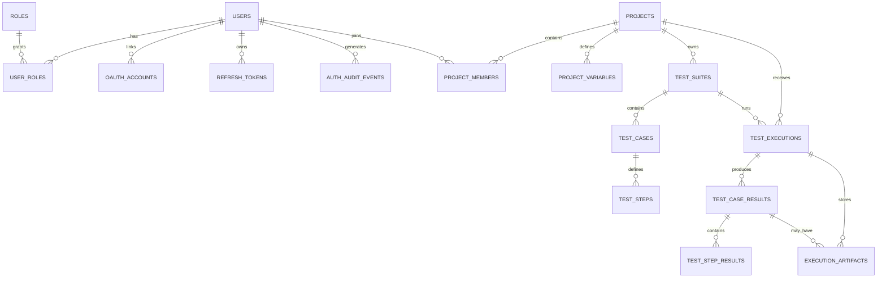

# Data Model, API, and Workflows

## 1. Data principles

The schema must preserve identity, authorization, execution ownership, and historical truth.

Four rules drive the model:

1. mutable definitions must not rewrite old results;
2. refresh tokens must be revocable and replay-detectable;
3. multiple workers must not claim the same execution;
4. large artifacts belong outside PostgreSQL.

## 2. Entity relationship overview



## 3. Proposed tables

### `users`

```text
id UUID PK
email VARCHAR UNIQUE NOT NULL
password_hash VARCHAR NULL
display_name VARCHAR NOT NULL
avatar_url VARCHAR NULL
status VARCHAR NOT NULL
email_verified BOOLEAN NOT NULL
token_version INTEGER NOT NULL DEFAULT 0
last_login_at TIMESTAMPTZ NULL
created_at TIMESTAMPTZ NOT NULL
updated_at TIMESTAMPTZ NOT NULL
version BIGINT NOT NULL
```

Constraints:

- normalized email unique;
- status allowlist;
- password hash may be null only when another login method exists;
- optimistic version for administrative updates.

### `roles`

```text
id BIGSERIAL PK
code VARCHAR UNIQUE NOT NULL
name VARCHAR NOT NULL
```

Seed:

```text
ADMIN
TEST_MANAGER
MEMBER
```

### `user_roles`

```text
user_id UUID FK
role_id BIGINT FK
created_at TIMESTAMPTZ
PRIMARY KEY (user_id, role_id)
```

### `oauth_accounts`

```text
id UUID PK
user_id UUID FK
provider VARCHAR NOT NULL
provider_subject VARCHAR NOT NULL
provider_email VARCHAR NULL
created_at TIMESTAMPTZ NOT NULL
last_login_at TIMESTAMPTZ NULL
UNIQUE (provider, provider_subject)
```

### `refresh_tokens`

```text
id UUID PK
user_id UUID FK
family_id UUID NOT NULL
token_hash VARCHAR UNIQUE NOT NULL
issued_at TIMESTAMPTZ NOT NULL
expires_at TIMESTAMPTZ NOT NULL
used_at TIMESTAMPTZ NULL
revoked_at TIMESTAMPTZ NULL
revocation_reason VARCHAR NULL
replaced_by_token_id UUID NULL
user_agent VARCHAR NULL
created_ip VARCHAR NULL
```

Indexes:

- token hash unique;
- user and active state;
- family;
- expiry for cleanup.

### `projects`

```text
id UUID PK
name VARCHAR NOT NULL
description TEXT NULL
base_url VARCHAR NOT NULL
environment VARCHAR NULL
status VARCHAR NOT NULL
default_browser VARCHAR NOT NULL
default_timeout_seconds INTEGER NOT NULL
created_by UUID FK
created_at TIMESTAMPTZ NOT NULL
updated_at TIMESTAMPTZ NOT NULL
version BIGINT NOT NULL
```

Constraints:

- valid HTTP/HTTPS URL;
- status `ACTIVE` or `ARCHIVED`;
- timeout within platform limits.

### `project_members`

```text
project_id UUID FK
user_id UUID FK
project_role VARCHAR NOT NULL
created_at TIMESTAMPTZ NOT NULL
PRIMARY KEY (project_id, user_id)
```

### `project_variables`

```text
id UUID PK
project_id UUID FK
variable_key VARCHAR NOT NULL
value_ciphertext TEXT NULL
is_secret BOOLEAN NOT NULL
created_at TIMESTAMPTZ NOT NULL
updated_at TIMESTAMPTZ NOT NULL
UNIQUE (project_id, variable_key)
```

Non-secret values may be stored directly according to implementation choice. Secret values require encryption or environment injection.

### `test_suites`

```text
id UUID PK
project_id UUID FK
name VARCHAR NOT NULL
description TEXT NULL
priority VARCHAR NOT NULL
status VARCHAR NOT NULL
tags JSONB NULL
created_at TIMESTAMPTZ NOT NULL
updated_at TIMESTAMPTZ NOT NULL
version BIGINT NOT NULL
```

### `test_cases`

```text
id UUID PK
test_suite_id UUID FK
name VARCHAR NOT NULL
description TEXT NULL
preconditions TEXT NULL
priority VARCHAR NOT NULL
status VARCHAR NOT NULL
retry_policy VARCHAR NOT NULL
data_isolation VARCHAR NULL
created_at TIMESTAMPTZ NOT NULL
updated_at TIMESTAMPTZ NOT NULL
version BIGINT NOT NULL
```

### `test_steps`

```text
id UUID PK
test_case_id UUID FK
step_order INTEGER NOT NULL
action_type VARCHAR NOT NULL
locator_type VARCHAR NULL
locator_value TEXT NULL
input_value TEXT NULL
expected_value TEXT NULL
timeout_seconds INTEGER NULL
metadata JSONB NULL
created_at TIMESTAMPTZ NOT NULL
updated_at TIMESTAMPTZ NOT NULL
UNIQUE (test_case_id, step_order)
```

Secret inputs should reference project variables, not contain resolved secrets.

### `test_executions`

```text
id UUID PK
project_id UUID FK
test_suite_id UUID FK
requested_by UUID FK
status VARCHAR NOT NULL
priority VARCHAR NOT NULL
queued_at TIMESTAMPTZ NOT NULL
claimed_at TIMESTAMPTZ NULL
started_at TIMESTAMPTZ NULL
finished_at TIMESTAMPTZ NULL
worker_id VARCHAR NULL
heartbeat_at TIMESTAMPTZ NULL
attempt_number INTEGER NOT NULL
total_cases INTEGER NOT NULL
completed_cases INTEGER NOT NULL
passed_cases INTEGER NOT NULL
failed_cases INTEGER NOT NULL
error_cases INTEGER NOT NULL
skipped_cases INTEGER NOT NULL
duration_ms BIGINT NULL
target_base_url_snapshot TEXT NOT NULL
browser_snapshot VARCHAR NOT NULL
definition_snapshot JSONB NOT NULL
error_category VARCHAR NULL
error_message TEXT NULL
created_at TIMESTAMPTZ NOT NULL
```

### `test_case_results`

```text
id UUID PK
execution_id UUID FK
test_case_id UUID NULL
test_case_name_snapshot VARCHAR NOT NULL
definition_snapshot JSONB NOT NULL
status VARCHAR NOT NULL
attempt_number INTEGER NOT NULL
started_at TIMESTAMPTZ NULL
finished_at TIMESTAMPTZ NULL
duration_ms BIGINT NULL
error_category VARCHAR NULL
error_message TEXT NULL
stack_trace TEXT NULL
```

### `test_step_results`

Optional for the first milestone, recommended later:

```text
id UUID PK
test_case_result_id UUID FK
test_step_id UUID NULL
step_order INTEGER NOT NULL
step_snapshot JSONB NOT NULL
status VARCHAR NOT NULL
started_at TIMESTAMPTZ NULL
finished_at TIMESTAMPTZ NULL
duration_ms BIGINT NULL
actual_value TEXT NULL
expected_value TEXT NULL
error_message TEXT NULL
```

### `execution_artifacts`

```text
id UUID PK
execution_id UUID FK
test_case_result_id UUID NULL
artifact_type VARCHAR NOT NULL
storage_key TEXT NOT NULL
original_filename VARCHAR NULL
content_type VARCHAR NOT NULL
size_bytes BIGINT NOT NULL
checksum VARCHAR NULL
created_at TIMESTAMPTZ NOT NULL
expires_at TIMESTAMPTZ NULL
```

### `auth_audit_events`

```text
id UUID PK
user_id UUID NULL
event_type VARCHAR NOT NULL
success BOOLEAN NOT NULL
ip_address VARCHAR NULL
user_agent VARCHAR NULL
metadata JSONB NULL
created_at TIMESTAMPTZ NOT NULL
```

Metadata is filtered; it must not contain credentials or tokens.

## 4. Delete and retention behavior

| Record | Behavior |
|---|---|
| User | Disable or anonymize; preserve execution/audit references. |
| OAuth link | Remove only when another login method remains. |
| Refresh token | Revoke; purge after security retention. |
| Project | Archive after history exists. |
| Suite/case | Disable or soft-delete when referenced by results. |
| Execution | Retain according to project policy. |
| Artifact | Delete bytes and metadata together. |
| Secret variable | Rotate/remove carefully; existing snapshots never contain resolved secret. |

## 5. Important indexes

Start with measured, workload-oriented indexes:

```sql
CREATE INDEX idx_execution_queue
ON test_executions (status, priority, queued_at, id);

CREATE INDEX idx_execution_project_time
ON test_executions (project_id, created_at DESC);

CREATE INDEX idx_execution_worker_heartbeat
ON test_executions (status, heartbeat_at)
WHERE status = 'RUNNING';

CREATE INDEX idx_case_result_execution
ON test_case_results (execution_id);

CREATE INDEX idx_suite_project
ON test_suites (project_id);

CREATE INDEX idx_case_suite
ON test_cases (test_suite_id);

CREATE INDEX idx_refresh_user_active
ON refresh_tokens (user_id, expires_at)
WHERE revoked_at IS NULL;
```

Indexes accelerate reads but increase writes and storage. Add them from query plans rather than habit.

## 6. Migration policy

Use Flyway as the schema authority:

```text
V001__create_users_and_roles.sql
V002__create_oauth_accounts.sql
V003__create_refresh_tokens.sql
V004__create_projects_and_members.sql
V005__create_project_variables.sql
V006__create_test_suites.sql
V007__create_test_cases_and_steps.sql
V008__create_executions_and_results.sql
V009__create_execution_artifacts.sql
V010__create_auth_audit_events.sql
```

Rules:

- `ddl-auto=validate`;
- applied versioned migrations are immutable;
- corrections use a new migration;
- clean-database and upgrade-path tests both run;
- no production secrets or passwords in seed migrations.

## 7. API conventions

Base path:

```text
/api/v1
```

General response rules:

- `200 OK`: read or update;
- `201 Created`: resource creation;
- `202 Accepted`: queued execution;
- `204 No Content`: successful delete/logout without body;
- `400 Bad Request`: malformed or validation error;
- `401 Unauthorized`: missing/invalid authentication;
- `403 Forbidden`: authenticated but not permitted;
- `404 Not Found`: unavailable resource;
- `409 Conflict`: duplicate, stale version, or invalid transition;
- `429 Too Many Requests`: throttling or capacity policy;
- `503 Service Unavailable`: execution infrastructure unavailable.

### Error format

```json
{
  "type": "https://testops.example/problems/validation-error",
  "title": "Validation failed",
  "status": 400,
  "detail": "One or more fields are invalid.",
  "instance": "/api/v1/projects",
  "timestamp": "2026-07-17T12:30:00Z",
  "correlationId": "request-id",
  "errors": {
    "name": "Name is required"
  }
}
```

## 8. Proposed route surface

Exact mappings remain `TODO: verify`.

### Authentication

| Method | Route | Purpose |
|---|---|---|
| `POST` | `/auth/register` | Create password account. |
| `POST` | `/auth/login` | Authenticate email/password. |
| `POST` | `/auth/refresh` | Rotate refresh token and issue access JWT. |
| `POST` | `/auth/logout` | Revoke and clear session. |
| `GET` | `/auth/me` | Current local user. |
| `GET` | `/oauth2/authorization/google` | Start Google login. |
| `GET` | `/login/oauth2/code/google` | Google callback. |
| `GET` | `/users/me/sessions` | Active refresh sessions. |
| `DELETE` | `/users/me/sessions/{id}` | Revoke a session. |

### Administration

| Method | Route | Purpose |
|---|---|---|
| `GET` | `/users` | Paginated users. |
| `GET` | `/users/{id}` | User detail. |
| `PATCH` | `/users/{id}/status` | Lock, disable, or activate. |
| `PUT` | `/users/{id}/roles` | Replace global roles. |

### Projects and membership

| Method | Route | Purpose |
|---|---|---|
| `GET` | `/projects` | Accessible projects. |
| `POST` | `/projects` | Create project. |
| `GET` | `/projects/{id}` | Project detail. |
| `PUT` | `/projects/{id}` | Update project. |
| `POST` | `/projects/{id}/archive` | Archive project. |
| `GET` | `/projects/{id}/members` | Project membership. |
| `PUT` | `/projects/{id}/members/{userId}` | Add/change member. |
| `DELETE` | `/projects/{id}/members/{userId}` | Remove member. |

### Variables

| Method | Route | Purpose |
|---|---|---|
| `GET` | `/projects/{id}/variables` | List names and metadata; secrets masked. |
| `POST` | `/projects/{id}/variables` | Add variable. |
| `PUT` | `/projects/{id}/variables/{key}` | Rotate/update. |
| `DELETE` | `/projects/{id}/variables/{key}` | Remove. |

### Suites, cases, and steps

| Resource | Intended routes |
|---|---|
| Suites | `/projects/{projectId}/test-suites`, `/test-suites/{id}` |
| Cases | `/test-suites/{suiteId}/test-cases`, `/test-cases/{id}` |
| Steps | `/test-cases/{caseId}/steps`, `/test-steps/{id}` |
| Reorder | explicit reorder endpoint or ordered bulk update with optimistic version |

### Executions

| Method | Route | Purpose |
|---|---|---|
| `POST` | `/test-suites/{id}/executions` | Queue suite. |
| `POST` | `/test-cases/{id}/executions` | Optional single-case run. |
| `GET` | `/executions` | Filtered history. |
| `GET` | `/executions/{id}` | Progress and summary. |
| `GET` | `/executions/{id}/results` | Per-case results. |
| `POST` | `/executions/{id}/cancel` | Request cancellation. |
| `GET` | `/artifacts/{id}` | Authorized artifact download/view. |

### Dashboard

```text
GET /dashboard/summary
GET /dashboard/trends
GET /dashboard/recent-failures
GET /dashboard/infrastructure-errors
```

## 9. Workflow: registration

Trigger: anonymous user submits account data.

Normal path:

1. normalize email;
2. validate password policy;
3. insert user;
4. assign default role;
5. write audit event;
6. optionally send verification;
7. issue session only when policy allows.

Failure path:

- duplicate returns `409`;
- validation returns field errors;
- email provider failure does not silently create a “verified” account;
- no token is issued before transaction success.

User-visible result: authenticated dashboard or verification-required page.

## 10. Workflow: Google login

Trigger: user clicks Google sign-in.

Normal path:

1. backend creates authorization state;
2. Google authenticates;
3. backend validates callback;
4. resolve local account by provider `sub`;
5. apply account-link policy;
6. issue refresh cookie;
7. redirect to frontend callback;
8. frontend calls refresh;
9. receive TestOps JWT.

Failure path:

- denied consent returns a stable message;
- invalid state fails closed;
- account-link conflict requests confirmation;
- disabled local user receives no session;
- provider outage does not invalidate existing sessions.

## 11. Workflow: create a test case

Trigger: editor submits case and ordered steps.

Normal path:

1. authorize project edit access;
2. validate case fields;
3. validate every action/locator pair;
4. validate variable references;
5. validate URL policy;
6. persist case and ordered steps in one transaction;
7. return created definition.

Failure path:

- invalid step rejects the whole write;
- duplicate order returns validation;
- missing secret variable returns explicit reference error;
- stale optimistic version returns `409`.

## 12. Workflow: queue and claim execution

### Queue

1. authorize execution permission;
2. verify project active;
3. verify suite has enabled cases;
4. create immutable definition and target snapshots;
5. create `QUEUED` execution;
6. return `202 Accepted`.

### Claim

A worker claims one row atomically:

```sql
WITH next_execution AS (
    SELECT id
    FROM test_executions
    WHERE status = 'QUEUED'
    ORDER BY priority DESC, queued_at, id
    FOR UPDATE SKIP LOCKED
    LIMIT 1
)
UPDATE test_executions e
SET status = 'RUNNING',
    worker_id = :workerId,
    claimed_at = NOW(),
    started_at = NOW(),
    heartbeat_at = NOW()
FROM next_execution n
WHERE e.id = n.id
RETURNING e.*;
```

The claim transaction commits before Playwright starts.

Failure path:

- queue capacity policy may reject before insert;
- no worker leaves state queued and visible;
- two workers cannot both own one row;
- abandoned running state is recovered by heartbeat policy.

## 13. Workflow: execute a case

1. create isolated `BrowserContext`;
2. create page;
3. resolve project variables;
4. run ordered steps;
5. save step/case results incrementally;
6. capture screenshot and trace on failure/error policy;
7. close context;
8. continue or stop according to suite policy;
9. aggregate final execution state.

Failure handling:

- assertion mismatch: `FAILED`;
- target unavailable: `ERROR`;
- browser crash: `ERROR`;
- artifact failure: preserve original result and record secondary error;
- cancellation: stop at a safe boundary and close browser;
- cleanup failure: log and report without hiding primary outcome.

## 14. Workflow: retry

Default:

```text
NEVER
INFRASTRUCTURE_ERRORS_ONLY
ALWAYS
```

For e-commerce mutation tests, default to `NEVER` or `INFRASTRUCTURE_ERRORS_ONLY`.

Retry is allowed only when:

- the case is idempotent;
- test data is resettable;
- a duplicate order or checkout cannot be created;
- attempt number and previous evidence remain visible.

Do not overwrite the first attempt.

## 15. Workflow: dashboard

Dashboard queries read persisted results.

Pass rate:

```text
passed / (passed + failed) * 100
```

Infrastructure errors are separate.

Recommended dimensions:

- project;
- suite;
- date range;
- browser;
- functional status;
- infrastructure error category.

Use database aggregation and indexes rather than loading all results into Java.

## 16. Workflow: artifact access

1. authenticate;
2. authorize project membership;
3. find metadata;
4. validate retention and existence;
5. return safe inline/download response or short-lived signed URL;
6. audit sensitive artifact access if policy requires.

Artifact filenames are generated, not built from user test names.

## 17. Polling contract

Frontend polls while:

```text
QUEUED
RUNNING
CANCEL_REQUESTED
```

Stops on:

```text
PASSED
FAILED
ERROR
CANCELLED
```

Use a moderate interval such as 2–5 seconds and back off for long queues. Do not create a new polling loop per component render.

## 18. Definition snapshot example

```json
{
  "suiteName": "Checkout regression",
  "targetBaseUrl": "https://staging-shop.example.com",
  "browser": "chromium",
  "cases": [
    {
      "caseId": "uuid",
      "name": "Reject missing shipping address",
      "steps": [
        {
          "order": 1,
          "action": "NAVIGATE",
          "input": "/checkout"
        },
        {
          "order": 2,
          "action": "CLICK",
          "locator": {
            "type": "ROLE",
            "role": "BUTTON",
            "name": "Place order"
          }
        },
        {
          "order": 3,
          "action": "ASSERT_TEXT_CONTAINS",
          "locator": {
            "type": "TEST_ID",
            "value": "address-error"
          },
          "expected": "Shipping address is required"
        }
      ]
    }
  ]
}
```

Resolved secret values are excluded.

## 19. Concurrency invariants

- one refresh token use creates at most one replacement;
- one execution has at most one active owner;
- terminal execution state cannot return to running;
- case result counters equal persisted results;
- step order is unique;
- project membership is unique;
- an artifact belongs to one authorized execution boundary;
- cancellation and completion race resolves to one terminal state.

These invariants require database constraints and transactional service methods, not only Java `if` statements.
