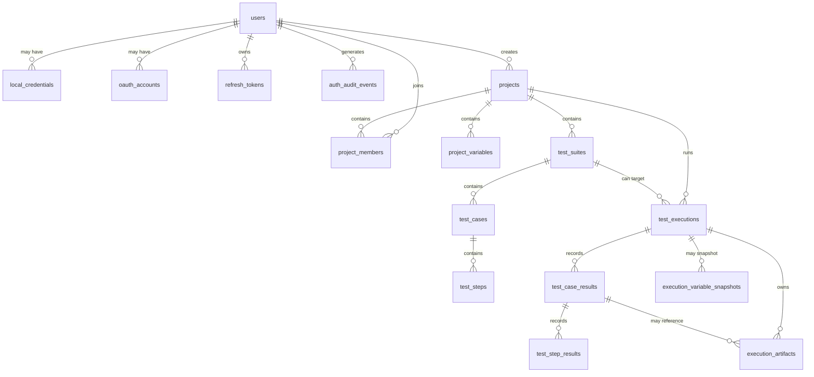
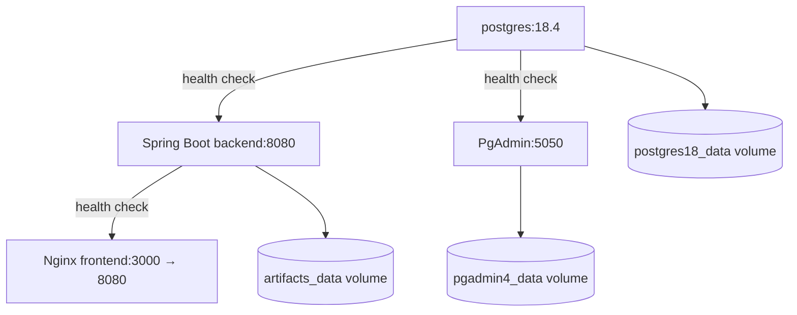

# Database and Runtime Walkthrough

This document explains how the PostgreSQL schema, Flyway migrations, Docker Compose services, environment files, local scripts, and CI fit together.

## 1. Database ownership model

The project uses two layers for database behavior:

```text
Flyway SQL migrations → physical tables, constraints, indexes
JPA entities          → Java representation and state transitions
Spring repositories   → query and lock access
Services              → business rules and transactions
```

Hibernate is configured with:

```yaml
spring:
  jpa:
    hibernate:
      ddl-auto: validate
```

`validate` means Hibernate checks that the mapped entities match the existing schema. It does not create or update tables. Flyway is the schema owner.

## 2. Migration lifecycle

Migration files live under [`backend/src/main/resources/db/migration`](../backend/src/main/resources/db/migration) and follow Flyway’s naming convention:

```text
V<version>__<description>.sql
```

Examples:

- `V001__create_users_and_roles.sql`
- `V007__create_projects_and_members.sql`
- `V011__create_execution_queue_and_results.sql`
- `V014__migrate_project_roles_and_remove_legacy_roles.sql`

At startup:

1. Flyway reads the database migration history.
2. It applies missing versions in numeric order.
3. It records applied versions in Flyway’s history table.
4. The JPA entity manager validates the resulting schema.
5. The application starts only if migration and validation succeed.

Do not edit an applied migration. Add a new migration for a new column, index, constraint, or data transformation.

## 3. Relational model



### Identity tables

| Table | Purpose |
| --- | --- |
| `users` | Canonical local identity, status, verification, platform role, and token version. |
| `local_credentials` | Optional BCrypt password credential. Google-only accounts have no row. |
| `oauth_accounts` | Provider subject mapping, currently Google. |
| `refresh_tokens` | Hashed, rotating, family-tracked refresh sessions. |
| `email_verification_challenges` | Hashed OTP challenges with expiry and attempt limits. |
| `auth_audit_events` | Login, verification, replay, and session events. |

### Project and definition tables

| Table | Purpose |
| --- | --- |
| `projects` | Target origin, status, name, owner reference, and optimistic version. |
| `project_members` | User/project relationship and project role. |
| `project_variables` | Plain or AES-GCM encrypted variables. |
| `project_audit_events` | Project membership/settings history. |
| `test_suites` | Named case groups. |
| `test_cases` | Case metadata, readiness, priority, retry count, and isolation flag. |
| `test_steps` | Ordered action/locator/input/assertion definitions. |

### Execution tables

| Table | Purpose |
| --- | --- |
| `test_execution_queue_guard` | One-row active queue counter for bounded capacity. |
| `test_executions` | One suite/case run and aggregate counters. |
| `test_case_results` | One case’s status, attempts, timing, and error. |
| `test_step_results` | Per-position outcome and error evidence. |
| `execution_artifacts` | Metadata for screenshots/traces stored on disk. |
| `execution_variable_snapshots` | Reserved durable snapshot shape for execution inputs. |

## 4. Constraints are part of the design

Application validation is useful for readable errors, but PostgreSQL constraints protect data even if another client bypasses the API.

Examples:

```sql
CONSTRAINT test_steps_case_position_unique UNIQUE (case_id, position)
CONSTRAINT project_members_project_user_unique UNIQUE (project_id, user_id)
CONSTRAINT uq_execution_idempotency UNIQUE(project_id, idempotency_key)
```

The variable table also enforces a shape invariant:

```text
plain variable  → plaintext_value present, ciphertext/nonce absent
secret variable → plaintext_value absent, ciphertext/nonce/key_version present
```

This prevents a row from being simultaneously marked secret and storing a plaintext value.

## 5. Deletion and history behavior

Foreign keys use cascade deletion for project-owned definitions and execution child rows where history is intentionally owned by the parent. User references in audit tables use `ON DELETE SET NULL` so the audit record can remain without retaining a deleted user row.

Important consequences:

- deleting a project deletes its members, variables, suites, cases, steps, and project audit events;
- deleting an execution deletes its case/step results, artifacts metadata, and variable snapshots;
- deleting a user does not erase authentication audit history;
- mutable case definitions are not a full immutable version history yet;
- execution rows retain result counters and links to the case that was run.

The roadmap calls for stronger immutable definition versions when historical reproducibility needs exceed the current snapshot foundation.

## 6. Queue and execution state in the database

Queueing is a transaction:

```text
lock queue_guard
  → reject if active_count >= capacity
  → increment active_count
  → insert test_executions (QUEUED)
  → insert test_case_results (QUEUED)
  → commit
```

Claiming is another transaction:

```text
lock oldest QUEUED execution
  → set RUNNING + started_at + heartbeat_at
  → commit
  → run browser outside the claim transaction
```

Keeping browser work outside the claim transaction is essential. A Playwright run can last minutes; holding a database transaction for that whole period would retain locks and exhaust the connection pool.

The worker updates heartbeats. A later poll marks a `RUNNING` execution as `ERROR` when its heartbeat is older than `EXECUTION_STALE_AFTER`.

## 7. Docker Compose runtime

[`docker-compose.yml`](../docker-compose.yml) defines four local services:



### PostgreSQL

- Image: `postgres:18.4-alpine3.24`.
- Port: `5432`.
- Credentials: `postgres_db/.env`.
- Data volume: `postgres18_data`.
- Health command: `pg_isready`.

### Backend

- Built from `backend/Dockerfile`.
- Build stage compiles the Spring Boot JAR with Maven.
- Runtime image includes Java 21 and Playwright’s browser dependencies.
- Port: `8080`.
- Secrets are mounted read-only from `backend/.secrets` to `/run/secrets/testops`.
- Artifacts are mounted at `/app/artifacts`.

### Frontend

- Built from `frontend/Dockerfile`.
- Node builds the Vite bundle.
- Nginx serves static assets and proxies API/OAuth paths to `backend:8080`.
- Host port `3000` maps to Nginx port `8080`.

### PgAdmin

- Port: `5050`.
- Uses `pgadmin4/.env`.
- Persists UI state in `pgadmin4_data`.

Health-gated `depends_on` means the backend waits for PostgreSQL health and the frontend waits for backend health. It does not guarantee that every application-level feature is configured correctly; health is still intentionally summary-only.

## 8. Environment files and secret boundaries

Compose reads scoped environment files:

```text
postgres_db/.env
backend/.env
frontend/.env
pgadmin4/.env
```

The committed `*.env.example` files contain placeholders and safe defaults. Real `.env` files are ignored.

The backend configuration is grouped by responsibility:

| Prefix/group | Examples |
| --- | --- |
| Database | `DB_URL`, `DB_USERNAME`, `DB_PASSWORD` |
| Auth | `AUTH_ENABLED`, JWT paths, cookie settings |
| Email | SMTP host/credentials, OTP pepper path |
| Google | client ID/secret, redirect URI derived from frontend origin |
| Execution | worker count, queue capacity, intervals, timeouts |
| Project variables | secret-variable flag, AES key path/version |
| Target | `TARGET_ALLOWED_ORIGINS` |
| Artifacts | `ARTIFACT_DIRECTORY` |

Never commit:

- `backend/.env`;
- PostgreSQL or PgAdmin real passwords;
- JWT private keys;
- Google client secrets;
- OTP pepper or AES variable keys;
- target-site passwords or tokens.

## 9. Local setup scripts

[`scripts/setup-local.ps1`](../scripts/setup-local.ps1) and [`scripts/setup-local.sh`](../scripts/setup-local.sh) are the supported local setup helpers.

They:

1. copy missing `.env.example` files to `.env`;
2. create `backend/.secrets`;
3. generate an RSA key pair;
4. generate an OTP pepper;
5. generate a project-variable key;
6. prompt for or generate a bootstrap-admin password;
7. optionally enable email registration and Google flags;
8. configure secret paths used by the Compose backend.

The default basic startup is:

```bash
docker compose up --build
```

For an authenticated local environment, use the setup script first, then start Compose. The scripts are designed to preserve existing local files unless `--force` or `-Force` is used.

## 10. Frontend proxy behavior

[`frontend/nginx.conf`](../frontend/nginx.conf) keeps browser calls same-origin:

```text
browser → http://localhost:3000/api/... → nginx → http://backend:8080/api/...
```

The same proxy handles:

- `/api/` API requests;
- `/actuator/` health;
- `/oauth2/` Google authorization start;
- `/login/oauth2/` Google callback;
- `/` static frontend and SPA fallback to `index.html`.

This is why the frontend uses relative URLs such as `/api/v1/auth/login` instead of embedding a backend host in TypeScript.

## 11. CI and verification

The local verification scripts and [`.github/workflows/ci.yml`](../.github/workflows/ci.yml) run similar gates:

### Frontend

```bash
npm ci
npm run lint
npm run typecheck
npm test -- --run
npm run build
```

### Backend

```bash
./mvnw -B test
./mvnw -B verify
```

CI installs Chromium for Playwright, so deterministic browser tests do not depend on a developer’s machine having a browser preinstalled.

### Containers

CI also:

1. creates safe local `.env` files from examples;
2. validates Compose syntax;
3. builds all images;
4. starts Compose;
5. polls backend and frontend health endpoints;
6. tears down the stack and volumes.

This validates assembly and startup without claiming that the external e-commerce target is always available.

## 12. A complete request-to-database example

For `POST /api/v1/projects/{projectId}/suites/{suiteId}/executions`:

```text
Browser
  → projectsApi.queueSuite()
  → apiFetch() adds Bearer token + cookie
  → nginx proxies /api/ to backend
  → Spring Security validates JWT
  → ExecutionController parses IDs and Idempotency-Key
  → ExecutionService resolves user/project/suite
  → ProjectAccessService checks project role
  → ExecutionService locks test_execution_queue_guard
  → PostgreSQL inserts test_executions + test_case_results
  → controller returns 202 + Location header
  → frontend invalidates execution list
```

Then, asynchronously:

```text
ExecutionWorker.poll()
  → recover stale executions
  → claim queued row
  → ExecutionRunService.run()
  → PlaywrightCaseRunner.run()
  → write test_case_results/test_step_results
  → ArtifactWriter writes file + execution_artifacts row
  → finish test_executions
  → release queue guard counter
  → frontend polling observes terminal state
```

## 13. Operational troubleshooting map

| Symptom | First places to inspect |
| --- | --- |
| Frontend cannot load | `docker compose ps`, frontend health, Nginx proxy, backend health. |
| Backend restarts | container logs, `application.yaml` binding, database health, Flyway validation. |
| Database schema error | latest Flyway file, migration history, JPA entity column names. |
| Auth disabled unexpectedly | `AUTH_ENABLED`, key paths, `backend/.secrets`, startup validator. |
| Registration unavailable | `AUTH_REGISTRATION_ENABLED`, `EMAIL_DELIVERY_ENABLED`, SMTP settings. |
| Google callback fails | exact `FRONTEND_ORIGIN`, redirect URI, Google client settings, proxy headers. |
| Queue remains queued | worker enabled, worker count, database claim query, queue capacity. |
| Execution becomes error | worker heartbeat, Playwright browser availability, target guard, artifacts permissions. |
| Artifact download fails | artifact metadata path, mounted artifact volume, root path validation. |
| Target rejected | project origin, `TARGET_ALLOWED_ORIGINS`, DNS/IP safety checks. |

Do not begin by changing timeout values. First determine which boundary failed: browser, target, worker, database, or frontend presentation.
