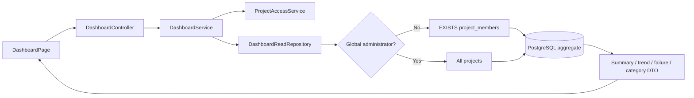

# Dashboard aggregate queries

## What changed

The reporting backend no longer loads every execution into Java and then loads each execution's case results separately. `DashboardService` now builds one authorization-aware filter and delegates each dashboard view to `DashboardReadRepository`.

This resolves two correctness and performance problems:

- the previous summary and recent-failure paths performed an unbounded execution scan followed by an N+1 sequence of case-result queries;
- infrastructure categories were calculated from the most recent 50 failed results, so older errors inside the selected date range silently disappeared from the category totals.

## UI-to-database workflow

The browser continues to use the existing API contract. No frontend or public DTO change was required.

## Source ownership

| Concern | Source | Responsibility |
| --- | --- | --- |
| Date-window defaults and maximum range | `backend/src/main/java/com/megumi/testops/dashboard/api/DashboardController.java` | Converts omitted dates to the last 30 days and rejects ranges longer than 366 days. |
| Authenticated reporting orchestration | `backend/src/main/java/com/megumi/testops/dashboard/service/DashboardService.java` | Resolves the caller once, normalizes filters, maps database rows to API DTOs, and calculates rates. |
| Tenant scoping and aggregation | `backend/src/main/java/com/megumi/testops/dashboard/repository/DashboardReadRepository.java` | Applies membership/global-admin predicates and executes bounded PostgreSQL reads. |
| UI rendering | `frontend/src/features/dashboard/DashboardPage.tsx` | Renders rates, recent failures, empty states, and category counts. |

## Query behavior

All reads share these predicates:

- `created_at >= from` and `created_at < to`;
- global administrators may read all projects;
- every other caller must have a matching `project_members` row for the execution's project;
- optional project, suite, and case-insensitive browser filters are added only when supplied.

Adding optional predicates dynamically avoids nullable-parameter type ambiguity in PostgreSQL while still binding every user-controlled value as a parameter. SQL text never contains a request value.

### Summary

One query counts executions and sums the persisted `passed_cases`, `failed_cases`, and `error_cases` counters. These counters are written as each case result completes and are the compact reporting representation of a run.

The functional pass-rate denominator is `passed + failed`. Infrastructure errors are deliberately excluded from that functional denominator. The infrastructure-error rate uses `passed + failed + error`.

### Trends

PostgreSQL groups execution counters by the UTC calendar date. UTC is explicit so the same execution cannot appear on different days depending on the backend host timezone.

### Recent failures

One join between `test_case_results` and `test_executions` applies the same tenant and date scope, orders newest failures first, and asks the database for at most 50 rows. Snapshot names are returned so archived or renamed definitions do not rewrite historical evidence.

### Infrastructure categories

The category query is independent from recent failures. It counts all `ERROR` case results with a nonblank category across the complete selected window, grouped and sorted in PostgreSQL. A dashboard can therefore show 74 target errors even though only 50 recent failure cards are displayed.

## Security properties

- Membership is enforced inside every query, before rows are returned to Java.
- Supplying a project or suite identifier does not bypass the membership predicate.
- Global access comes only from the authenticated JWT role decision made by `ProjectAccessService`.
- Failure messages remain the already-sanitized persisted messages; the dashboard repository does not resolve variables or secrets.
- The end of a time window is exclusive, preventing a boundary execution from appearing in two adjacent reports.

## Verification performed

- `DashboardServiceTest`: four focused tests cover scoped totals/rates, UTC trend mapping, the explicit 50-row recent limit, and the independent full-window category query.
- The backend image rebuilt and started healthy against the normal PostgreSQL database.
- Chrome DevTools observed `200` from summary, recent-failure, and infrastructure-category requests.
- An authenticated Chrome DevTools call observed `200` from the trends endpoint without exposing the access token.
- A read-only PostgreSQL execution of the UTC grouping returned four historical day buckets, proving the database-specific date expression.
- Recent backend logs contained no dashboard query exception.
- The isolated [dashboard PostgreSQL regression gate](../testing/32-dashboard-postgres-regression.md) passed a two-project, 57-error fixture on a clean V021 schema. It proved the hidden project and exact end boundary are excluded, recent failures stop at 50, and the full-window category remains 55.

The local full Maven integration phase may still depend on Docker Desktop named-pipe availability. CI remains the authoritative PostgreSQL integration gate.

## Troubleshooting

### The dashboard is empty even though another account has runs

Dashboard visibility is membership-scoped. Confirm that the signed-in account is a member of the project containing those executions. A global administrator can see all projects.

### A run at the end date is missing

The `to` value is exclusive. For a complete calendar day, send the start of the following UTC day as `to`.

### Category totals exceed the visible failure cards

This is expected. Recent failures are capped at 50 for a bounded UI response; categories cover the entire selected window.

### A PostgreSQL query fails after a schema change

The read repository intentionally names reporting tables and columns. Update it in the same migration slice, run the focused service tests, exercise all four endpoints, and verify the query against a clean migrated PostgreSQL database before publishing.
