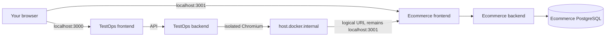

# Ecommerce dogfooding guide

This guide is for a first-time maintainer who wants to run the local ecommerce
website, connect it to TestOps, and execute a browser check safely. It describes
the complete path from Docker startup to a saved screenshot. It also explains
which work belongs in TestOps and which work belongs in the ecommerce
repository.

## 1. The two applications

There are two separate applications:

| Application | Repository | Host URL | Responsibility |
| --- | --- | --- | --- |
| TestOps | `D:\\Projects\\testops-platform` | `http://localhost:3000` | Test definitions, users, projects, permissions, runs, results, screenshots, and traces |
| Ecommerce | `D:\\Projects\\ecommerce-web\\webcky` | `http://localhost:3001` | The storefront under test: authentication, catalog, cart, checkout, orders, reviews, sellers, administration, and messaging |

TestOps does not own ecommerce data. A TestOps project stores the target URL
and the instructions for exercising that URL. The ecommerce PostgreSQL database
stores products, customers, carts, orders, and messages.

The normal local port map is:

| Service | Port |
| --- | ---: |
| TestOps frontend | 3000 |
| TestOps backend | 8080 |
| TestOps PostgreSQL | 5432 |
| TestOps PgAdmin | 5050 |
| Ecommerce frontend | 3001 |
| Ecommerce backend | 8081 |
| Ecommerce PostgreSQL | 5433 |
| Ecommerce PgAdmin | 5051 |

The ports are host ports. Containers use service names such as `backend` and
`postgres` on their internal Docker network, so a URL that works in a browser
is not necessarily the URL that works from a container.



## 2. Start the applications

Open two PowerShell windows. Start the ecommerce target first:

```powershell
cd D:\\Projects\\ecommerce-web\\webcky
docker compose up -d --build
docker compose ps
```

Then start TestOps:

```powershell
cd D:\\Projects\\testops-platform
docker compose up -d --build
docker compose ps
```

Wait until the application services report healthy. Useful diagnostics are:

```powershell
docker compose logs --tail 100 backend
docker compose logs --tail 100 frontend
```

Open `http://localhost:3001` to confirm the target site is usable and
`http://localhost:3000` to open TestOps. If the storefront does not load, fix
the ecommerce Compose stack before troubleshooting TestOps target security.

## 3. Allow the local target safely

TestOps deliberately blocks localhost targets by default. Enable the bridge in
the TestOps backend environment, keeping the exact origin allowlisted:

```dotenv
TARGET_ALLOWED_ORIGINS=http://localhost:3001
TARGET_LOCAL_DEV_ENABLED=true
TARGET_LOCAL_DEV_HOST_ALIAS=host.docker.internal
```

If `TARGET_ALLOWED_ORIGINS` already contains other origins, keep them and add
`http://localhost:3001` as a comma-separated entry. Do not add `127.0.0.1`, a
wildcard, an arbitrary LAN address, or an unapproved port.

Recreate the backend so Spring Boot reads the new values:

```powershell
cd D:\\Projects\\testops-platform
docker compose up -d --force-recreate backend
docker compose ps backend
```

The feature requires both the flag and the exact allowlist entry. The worker
opens the visible `localhost` URL but Docker routes the request through
`host.docker.internal`. This preserves cookies, same-origin behavior, and the
URL shown in screenshots while preventing arbitrary private-network access.

## 4. Create and check a project

1. Sign in to `http://localhost:3000` with a verified TestOps account.
2. Open **Projects** and choose **New project**.
3. Enter a name such as `Ecommerce` and the exact target origin
   `http://localhost:3001`.
4. Open the project and select **Check connection**.
5. Continue only when target health is **REACHABLE**.

The target-check endpoint is `POST /api/v1/projects/{projectId}/target-check`.
It runs an isolated browser check and stores only sanitized health metadata:
`NOT_CHECKED`, `REACHABLE`, `UNREACHABLE`, or `BLOCKED`, the HTTP status when
available, the check time, and a safe failure reason. It never stores the page
HTML. Members need `EXECUTION_START` to run a check; viewers can see the last
result.

If the card says **BLOCKED**, check the flag and exact allowlist before checking
the ecommerce process. If it says **UNREACHABLE**, inspect the ecommerce
container and host port. Do not weaken the guard to make a local check pass.

## 5. Build a reusable test case

The project workspace guides you through this order:

1. **Suites** → **New suite**. Use a domain name, for example `00 — Platform Smoke`.
2. Open the suite → **New case**.
3. In **Details**, enter a descriptive name and choose a priority.
4. In **Steps**, select a template or add steps manually.
5. In **Review**, correct validation errors, then choose **Save as ready**.
6. Return to the case and run it, or use **Save & run** when the case is valid.

A `READY` case must contain at least one step and its first step must be
`NAVIGATE`. The backend repeats all client validation, so editing the request
in browser tools cannot bypass these rules.

### Verified storefront homepage smoke

The source-controlled manifest at
`catalog/ecommerce-testops.json` contains this smallest useful smoke:

| Position | Action | Values | Why |
| ---: | --- | --- | --- |
| 0 | `NAVIGATE` | `/`; viewport `1280x720`; locale `en-US`; timezone `Asia/Ho_Chi_Minh` | Opens the project origin in a reproducible browser context |
| 1 | `ASSERT_VISIBLE` | `TEXT_EXACT`, `Danh mục sản phẩm`, index `0` | Confirms the storefront category heading is visible and selects the first exact match |
| 2 | `TAKE_SCREENSHOT` | no locator | Produces visual evidence for a non-secret run |

The catalog also keeps two deterministic guest search cases `READY`: **Search
state is shareable** opens `/search?q=shirt`, checks the labelled search input
with `ASSERT_VALUE`, and checks the exact URL; **Search no-results state** opens
a deliberately unknown term and checks the `Không tìm thấy sản phẩm` heading.
Both cases are safe to run repeatedly because they do not authenticate, mutate
cart state, or create an order.

`TEXT` is a forgiving text search; `TEXT_EXACT` requires an exact match.
`locatorIndex` is zero-based and is useful when a page has repeated semantic
matches. Prefer a role, label, test id, or exact visible text over CSS/XPath.

The first step may set viewport, locale, and timezone. Later steps inherit the
same browser context and cannot redefine those settings.

### Permanent local mock accounts

The ecommerce `dev` profile enables a repeatable, idempotent `MockDataSeeder`.
It creates these mock-only identities and reuses them on every restart:

| Identity | Email | Default password | Intended use |
| --- | --- | --- | --- |
| Verified customer | `mock.customer@example.test` | `MockCustomer!123` | Login, cart review, checkout entry, order and review reads |
| Unverified customer | `mock.unverified@example.test` | `MockUnverified!123` | Verification restriction and resend flows |
| Seller | `mock.seller@example.test` | `MockSeller!123` | Seller dashboard and ownership checks |

The seed also provides three categories, three approved products, a two-item
customer cart, a completed order, a verified-purchase review, and a customer ↔
seller message thread. These are development fixtures, not production
credentials. Override them with `MOCK_*` environment variables when needed, or
set `MOCK_DATA_ENABLED=false` to run against an intentionally empty database.
The TestOps manifest references the verified customer through
`TESTOPS_E2E_CUSTOMER_EMAIL` and `TESTOPS_E2E_CUSTOMER_PASSWORD`, so secret
values stay outside Git.

## 6. Understand the action language

The builder reads action descriptors from the platform options endpoint. The
descriptor determines which fields are relevant, so a `NAVIGATE` step does not
show locator controls and an assertion does not hide its expected value.

Common fields:

| Field | Used for | Example |
| --- | --- | --- |
| Locator type/value | Finding an element | `ROLE` / `button`; `TEXT_EXACT` / `Danh mục sản phẩm` |
| Locator index | Selecting a repeated match | `0` |
| Input value | `FILL`, `TYPE`, or `SELECT` | `{{E2E_CUSTOMER_EMAIL}}` |
| Expected value | Value, attribute, count, or URL assertions | `true`, `5`, or `/products` |
| Timeout | Maximum wait for the action | `15000` milliseconds |
| Exact text | Strict text matching | enabled for `TEXT_EXACT` |

Supported actions include navigation, clicks, filling and typing, selecting,
keyboard `PRESS`, `HOVER`, visibility/text/value/checked/enabled/disabled/
attribute/count/URL assertions, and screenshots. The backend rejects missing
required fields, invalid locator roles, unsafe navigation, invalid timeout
ranges, and malformed context settings.

Variables are interpolated in locator values, input values, expected values,
and navigation URLs. Generated values are available at execution time:

```text
${RUN_ID}
${CASE_RESULT_ID}
${RUN_TIMESTAMP}
```

Use `${...}` for a TestOps variable reference. Secret values can be used by a
worker but are never returned by an API or written into screenshots, traces,
logs, or error messages.

## 7. Run and read evidence

Queueing returns immediately with an execution id and a `202 Accepted` status.
The run transitions through `QUEUED`, `RUNNING`, and a terminal state:

```text
PASSED     every case and step passed
FAILED     the target produced a product/assertion failure
ERROR      infrastructure, target, browser, definition, or worker failure
CANCELLED  a user stopped the run
```

The run detail page shows the target snapshot, suite/browser context, case
result, ordered step results, duration, failure position, sanitized message,
failure category, and recovery guidance. A red step row identifies the first
failed action. Categories distinguish assertion, locator, timeout, blocked
navigation, unreachable target, browser crash, invalid definition, and worker
infrastructure failures.

Successful `TAKE_SCREENSHOT` steps attach an image to their step position.
Eligible failures can retain screenshots and Playwright traces. If a step uses
a genuine secret, evidence is intentionally suppressed to prevent credential
leaks. Non-secret variables do not suppress evidence.

## 8. Synchronize the reusable catalog

The manifest is version-controlled and the synchronizer uses TestOps APIs; it
never writes directly to the TestOps database. Stable `sync:` markers make
project, suite, case, and variable updates idempotent.

Start with a no-risk preflight:

```powershell
cd D:\\Projects\\testops-platform
.\\scripts\\sync-ecommerce-catalog.ps1 -Mode dry-run
```

The preflight validates actions, locator types, fields, contiguous positions,
timeouts, context settings, `READY` ordering, and local variable references
before making an API call. It should report:

```text
Manifest validation passed: 9 suites, 10 cases.
Dry run complete. No API calls were made.
```

For an apply, use a short-lived TestOps token and provide values through the
environment rather than editing the JSON:

```powershell
$env:TESTOPS_TOKEN = '<short-lived-local-token>'
$env:TESTOPS_E2E_CUSTOMER_EMAIL = '<seeded-customer-email>'
$env:TESTOPS_E2E_CUSTOMER_PASSWORD = '<seeded-customer-password>'
.\\scripts\\sync-ecommerce-catalog.ps1 -Mode apply
```

The default API base is `http://localhost:8080`; override it with
`-BaseUrl` when TestOps runs elsewhere. The script creates or updates the
`Ecommerce` project and its suites, creates cases as `DRAFT`, and promotes only
manifest cases that pass readiness validation to `READY`.

The current catalog intentionally keeps credentialed, destructive, Mailpit,
two-user WebSocket, concurrency, seller, and administrator scenarios as
`DRAFT` or `runner:native`. TestOps is strongest for reusable single-browser
journeys. Native ecommerce tests remain the correct home for transactional
concurrency, email interception, multi-user realtime behavior, and isolated
database reset orchestration.

## 9. E2E topology and safe reset

The TestOps E2E profile is separate from the normal development stack:

| Service | E2E host port |
| --- | ---: |
| TestOps frontend | 3100 |
| TestOps backend | 8180 |
| TestOps PostgreSQL | 55432 |
| Mailpit UI/SMTP | 8025 / 1025 |
| Static target fixture | 3201 |

Start it with:

```powershell
cd D:\\Projects\\testops-platform
docker compose -p testops-e2e -f docker-compose.yml -f docker-compose.e2e.yml up -d --build
```

Run the enabled local-target contract:

```powershell
cd D:\\Projects\\testops-platform\\frontend
$env:E2E_BASE_URL = 'http://localhost:3100'
$env:ECOMMERCE_BASE_URL = 'http://localhost:3001'
$env:PW_WORKERS = '1'
npm run e2e
```

The disabled-local-target negative profile uses frontend `3101`, backend
`8181`, Mailpit `8026`, and target fixture `3202`:

```powershell
cd D:\\Projects\\testops-platform
docker compose -p testops-e2e-disabled -f docker-compose.yml -f docker-compose.e2e.yml -f docker-compose.e2e-local-disabled.yml up -d --build
cd frontend
$env:E2E_DISABLED_BASE_URL = 'http://localhost:3101'
$env:MAILPIT_URL = 'http://127.0.0.1:8026'
npx playwright test e2e/local-target-disabled.spec.ts
```

To reset only the enabled E2E database, stop that project and remove its named
volume. Verify the name before removal:

```powershell
docker compose -p testops-e2e -f docker-compose.yml -f docker-compose.e2e.yml down
docker volume ls --filter name=testops-e2e
# Remove only the dedicated postgres18_data volume shown above.
docker volume rm testops-e2e_postgres18_data
```

Never use this reset command against the normal Compose project. It must not
touch the ecommerce development volume or the normal TestOps PostgreSQL
volume.

## 10. Troubleshooting checklist

### Login says `Network Error`

Open browser developer tools and check whether the request went to
`localhost:8080`. The ecommerce frontend must use same-origin `/api`; rebuild
the ecommerce frontend if an old static bundle still contains a hard-coded
backend port. Then inspect `docker compose ps` and backend logs.

### Target health is `BLOCKED`

Confirm all three TestOps values are present, the origin is exactly
`http://localhost:3001`, and the backend was recreated. `127.0.0.1`, HTTPS,
wildcards, private IPs, and unlisted ports are intentionally rejected.

### Target health is `UNREACHABLE`

Open `http://localhost:3001` directly, verify the ecommerce frontend and
backend are healthy, and confirm port `3001` is not occupied by another
process. From a container, `localhost` means the container itself; the worker
requires the `host.docker.internal` bridge.

### No case can be run

The case is probably `DRAFT`, empty, or starts with a non-`NAVIGATE` step.
Use the builder’s **Review** stage and save it as `READY` after fixing the
field-specific errors.

### Locator failure

Prefer a role, label, test id, or exact visible text. Confirm the locator value
is the text rendered by the current page and remember that `locatorIndex` starts
at zero. Re-run the target check first if the page itself is unavailable.

### Mailpit appears empty

Mailpit belongs to the E2E profile, not the normal development Compose stack.
Open `http://localhost:8025` for the enabled profile and confirm the backend
uses `MAIL_HOST=mailpit` and SMTP port `1025`.

### Screenshot or trace is missing

Check whether the step used a secret variable; evidence suppression is an
intentional security behavior. Otherwise inspect the step result and artifact
list, confirm the run completed, and check worker logs for an artifact-storage
failure.

### Apply returns `401` or `403`

The synchronizer needs a valid TestOps bearer token and a project-management
permission. Run dry-run first, then set `TESTOPS_TOKEN` in the current shell.
Never commit the token or customer password.

## 11. What “done” means

For a beginner smoke, the smallest complete workflow is:

1. Both Compose stacks are healthy.
2. `http://localhost:3001` opens directly.
3. The TestOps backend has the exact local-target allowlist and feature flag.
4. The Ecommerce project target check is **REACHABLE**.
5. A suite contains the three-step homepage smoke and the case is `READY`.
6. The run reaches `PASSED`.
7. The run detail shows all three steps and the screenshot artifact.
8. `scripts/sync-ecommerce-catalog.ps1 -Mode dry-run` passes before any catalog apply.

After that smoke is reliable, expand coverage in the manifest and choose the
runner deliberately: TestOps for reusable browser journeys, native ecommerce
tests for email, two-user realtime, concurrency, and database-integrity cases.

## Verification record

On 2026-08-08 the live ecommerce Compose stack reported healthy for PostgreSQL,
the Spring Boot backend, and the React frontend. The native Playwright contract
ran with one worker against `http://localhost:3001` and passed all 9 tests,
including login-to-checkout entry, keyboard-safe cart cancellation, mobile
layout, shareable search state, retry behavior, pagination, and duplicate-submit
protection. The TestOps catalog preflight then passed with 9 suites and 12
cases, with no API calls during dry-run. Its READY set now includes the
non-destructive verified-customer login; dry-run still skips the two variable
values unless `TESTOPS_E2E_CUSTOMER_EMAIL` and
`TESTOPS_E2E_CUSTOMER_PASSWORD` are provided.

Related source walkthroughs:

- [UI-to-execution workflow](../implementation/17-ui-to-execution-workflow.md)
- [Feature implementation handbook](../implementation/18-feature-implementation-handbook.md)
- [Executable step language](../implementation/10-executable-step-language.md)
- [Catalog synchronization](../implementation/21-catalog-synchronization.md)
- [Live target recovery](16-live-target-recovery.md)
- [Ecommerce browser smoke contract](../implementation/19-ecommerce-browser-smoke.md)
