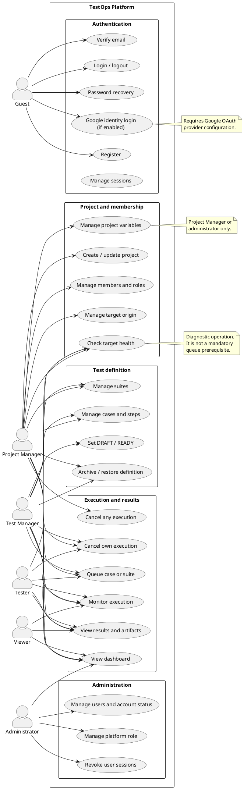
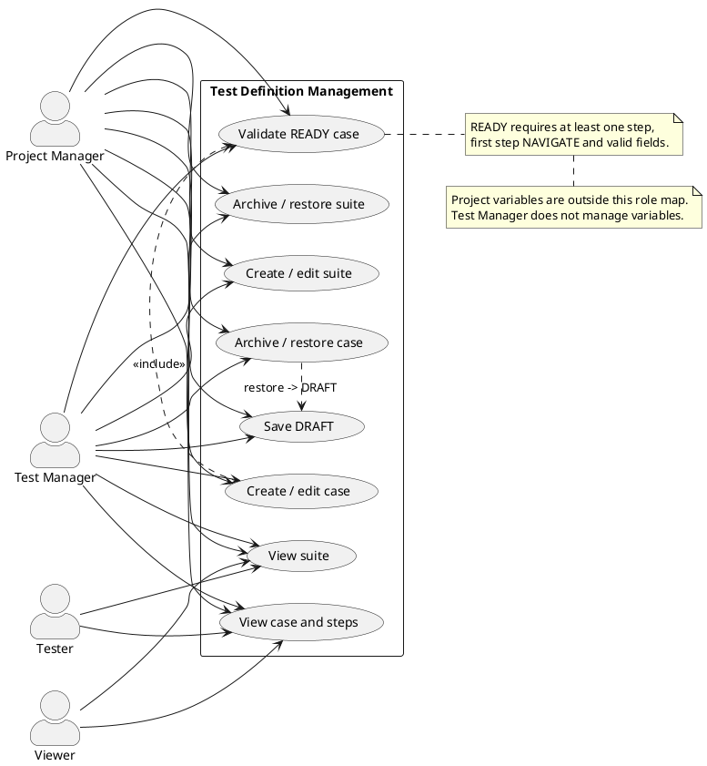
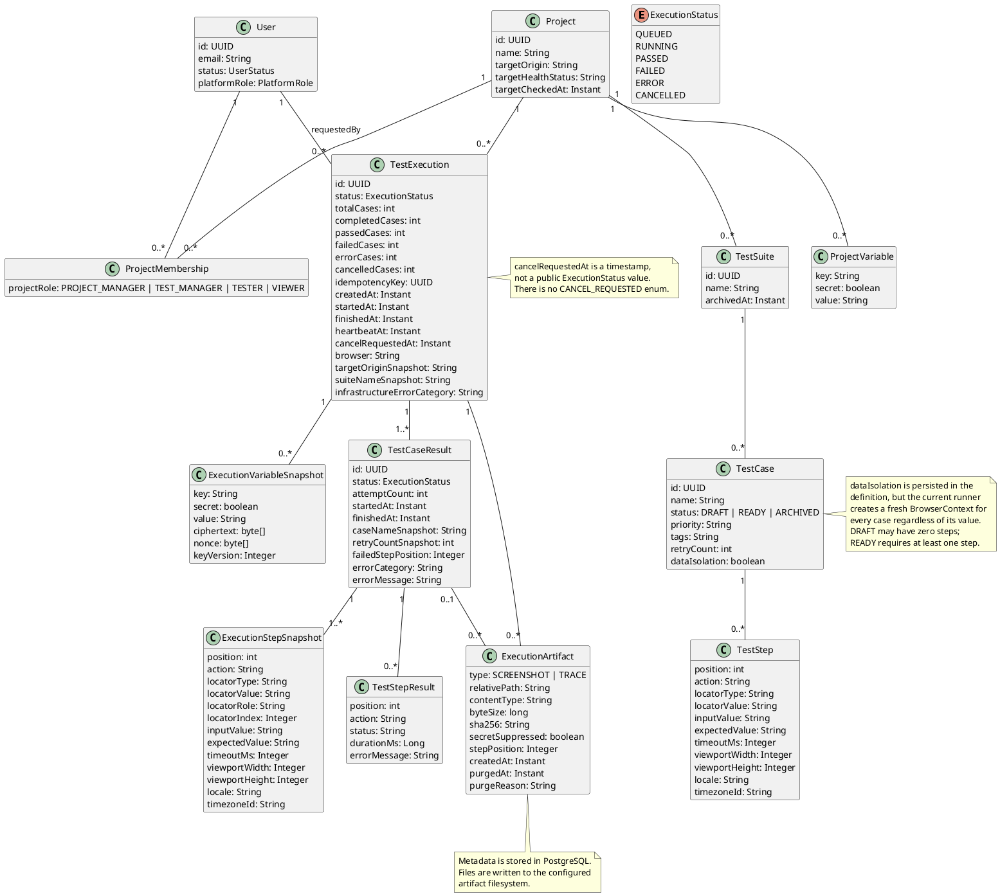
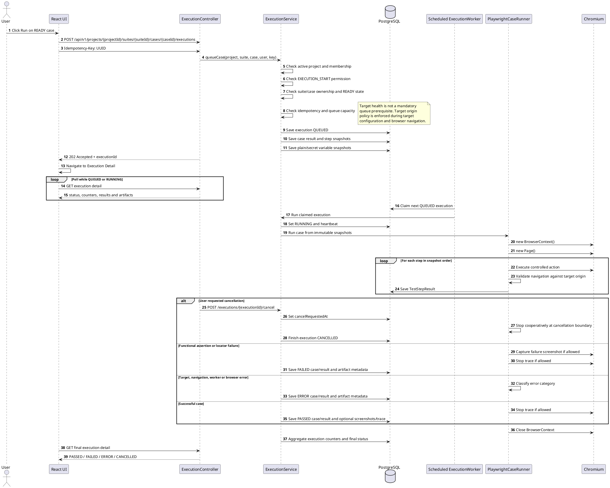

# Nội dung chỉnh sửa báo cáo thực tập — TestOps Platform

Tài liệu này là bản nội dung thay thế theo mục. Các phần không được nêu ở đây có thể giữ nguyên nếu không mâu thuẫn với các điều chỉnh bên dưới.

## Hướng dẫn sử dụng

- Giữ nguyên tiêu đề chương/mục hiện tại trong báo cáo Word.
- Tại mỗi vị trí được ghi bên dưới, thay đoạn cũ bằng đoạn mới tương ứng.
- Các đoạn đặt trong khối `PlantUML` dùng để cập nhật lại sơ đồ khi cần; không chép mã PlantUML vào phần nội dung chính của báo cáo.
- Các cụm `[10]`, `[11]`, … là chỉ số tài liệu tham khảo được bổ sung ở cuối tài liệu này.
- Báo cáo cần phân biệt ba mức độ: chức năng đã có trong source, chức năng đã có automated-test evidence và chức năng đã được xác minh trên runtime/browser.

---

## 1. Mở đầu và phạm vi nghiên cứu

### Vị trí: Chương mở đầu — mục “Phạm vi nghiên cứu”, khoảng trang 8

### Ý cần loại bỏ hoặc sửa

- Không viết rằng toàn bộ chức năng đăng ký, email, Google OAuth và secret variables luôn khả dụng trong mọi cấu hình.
- Không dùng “đã hoàn thiện” để thay thế cho “đã có trong source”.
- Không coi website thương mại điện tử mục tiêu là một phần chức năng do TestOps sở hữu.

### Nội dung thay thế

Đề tài tập trung vào phiên bản đầu tiên của TestOps Platform, một hệ thống hỗ trợ quản lý và thực thi kiểm thử giao diện web trên Chromium. Website thương mại điện tử được sử dụng như một target để kiểm thử; website này không thuộc phạm vi dữ liệu hoặc chức năng do TestOps Platform quản lý.

Phạm vi chức năng của hệ thống gồm quản lý tài khoản và phiên đăng nhập, quản lý project, thành viên và role, khai báo target origin, kiểm tra trạng thái target, quản lý test suite, test case, test step và project variable, lưu trạng thái DRAFT/READY, queue một case hoặc một suite, thực thi browser trên Chromium, theo dõi execution, xem case result, step result và artifact, cancel hoặc rerun theo quyền, dashboard và quản trị người dùng ở cấp nền tảng.

Các luồng đăng ký, xác minh email, khôi phục mật khẩu, Google OAuth và secret variables đã có implementation trong source nhưng phụ thuộc vào các feature flag, secret key, email provider hoặc OAuth provider của môi trường triển khai. Vì vậy, những chức năng này cần được mô tả là “đã triển khai và có thể bật theo cấu hình”, không phải là chức năng luôn hoạt động trong cấu hình mặc định.

Ở thời điểm lập báo cáo, bằng chứng của hệ thống được chia thành source evidence, automated-test evidence và runtime/browser evidence. Một chức năng có source và test không đồng nghĩa với việc toàn bộ luồng đã được xác minh lại trên runtime triển khai hiện tại. Những quality gate phụ thuộc Docker runtime, Chrome DevTools, email provider thật hoặc Google provider thật cần được ghi nhận riêng là runtime-unverified khi chưa có bằng chứng tương ứng.

Một số chức năng chưa thuộc bản đầu tiên gồm scheduling tự động, notification qua email hoặc chat, distributed worker, hỗ trợ nhiều browser engine, xóa vĩnh viễn lịch sử execution và truy cập tùy ý tới các địa chỉ mạng nội bộ. Việc giới hạn target origin là một lựa chọn an toàn của hệ thống, đồng thời cũng là một giới hạn về phạm vi sử dụng.

### Ghi chú nguồn

Các khái niệm về snapshot, queue, evidence và quality gate có thể đối chiếu trong [15], [16], [17] và [18].

---

## 2. Phương pháp thực hiện và nguồn tài liệu

### Vị trí: Chương mở đầu — mục “Phương pháp thực hiện”, khoảng trang 9

### Nội dung thay thế

Đề tài được thực hiện bằng cách kết hợp nghiên cứu tài liệu, phân tích yêu cầu, xây dựng implementation và kiểm thử theo nhiều lớp.

Trước hết, các khái niệm về kiểm thử giao diện web, test case, test suite, regression testing, execution queue và lưu bằng chứng được khảo sát để xác định các vấn đề mà một nền tảng TestOps cần giải quyết. Tiếp theo, yêu cầu được phân tích theo nhóm người dùng gồm administrator, Project Manager, Test Manager, Tester và Viewer. Mỗi nhóm được xem xét về dữ liệu được phép nhìn thấy, thao tác được phép thực hiện và các ranh giới project cần bảo vệ.

Sau đó, hệ thống được chia thành các nhóm nghiệp vụ gồm authentication, project and membership, test definition, execution, evidence, dashboard và administration. Mỗi nhóm được kiểm tra bằng source inspection, unit/service test, frontend test, integration test hoặc browser test tùy theo mức độ phù hợp.

Trong quá trình đánh giá, báo cáo phân biệt bốn loại bằng chứng:

1. **Source evidence:** hành vi có thể xác nhận từ controller, service, entity, migration, route hoặc configuration.
2. **Automated-test evidence:** hành vi được xác nhận bởi unit test, integration test, frontend test hoặc E2E test.
3. **Runtime/browser evidence:** hành vi được quan sát trên runtime đã build lại, qua browser hoặc DevTools.
4. **Runtime-unverified:** hành vi có source/test evidence nhưng chưa được kiểm tra lại trên runtime hoặc provider tương ứng trong lần đánh giá hiện tại.

Việc phân loại này giúp tránh đồng nhất giữa “đã có trong source”, “đã có test” và “đã được xác minh trong môi trường chạy thực tế”. Các kết luận trong báo cáo chỉ dùng mức khẳng định tương ứng với bằng chứng hiện có.

### Vị trí: Mục “Nguồn dữ liệu và tài liệu”, khoảng trang 9

### Nội dung thay thế

Báo cáo sử dụng ba nhóm nguồn. Nhóm thứ nhất là các trang và bài viết chính thức của FPT Software, dùng cho phần giới thiệu cơ quan thực tập, lịch sử FPT Complex, hiện diện tại Đà Nẵng và lĩnh vực dịch vụ [10]–[14]. Nhóm thứ hai là tài liệu chính thức của các công nghệ được sử dụng như Spring Boot, Spring Security, Playwright for Java, PostgreSQL, React, TypeScript, Docker Compose, Flyway và Google OpenID Connect [1]–[9]. Nhóm thứ ba là tài liệu nội bộ của TestOps Platform gồm technical specification, data model/API/workflows, quality-gate baseline, documentation truth audit và milestone completion ledger [15]–[19].

Các nguồn nội bộ được sử dụng để đối chiếu hành vi của hệ thống, nhưng phải phân biệt giữa implementation hiện tại, automated-test evidence và runtime evidence. Những nội dung chưa có runtime evidence không được diễn đạt như kết quả đã được xác minh đầy đủ trên môi trường triển khai.

---

## 3. Thông tin cơ quan thực tập và cơ sở lý thuyết

### Vị trí: Chương 1 — mục “Cơ quan thực tập”, khoảng trang 12

### Nội dung thay thế

**Tên cơ quan:** FPT Software Đà Nẵng  
**Địa chỉ:** FPT Complex Building, Nam Ky Khoi Nghia Street, Ngu Hanh Son Ward, Da Nang, Vietnam [11]  
**Email liên hệ văn phòng:** fsodn.contact@fpt.com [11]  
**Website:** https://fptsoftware.com

FPT Software là công ty thành viên của Tập đoàn FPT, hoạt động trong lĩnh vực phát triển phần mềm và cung cấp dịch vụ công nghệ cho khách hàng ở nhiều thị trường. Doanh nghiệp tổ chức nguồn lực theo các mô hình onshore, offshore và nearshore, phục vụ nhiều ngành và nhiều khu vực địa lý [10].

Các lĩnh vực được FPT Software giới thiệu gồm trí tuệ nhân tạo, dữ liệu, điện toán đám mây, an toàn thông tin, chuyển đổi số, digital commerce, Internet of Things, testing/digital assurance, hiện đại hóa ứng dụng và managed services [10], [14]. Những lĩnh vực này cho thấy chất lượng phần mềm, tự động hóa kiểm thử và khả năng truy vết kết quả là các vấn đề phù hợp để nghiên cứu trong môi trường doanh nghiệp công nghệ.

FPT Complex được FPT Software giới thiệu là campus thứ tư tại thời điểm khai trương năm 2016, với định hướng cung cấp môi trường làm việc quy mô lớn và chú trọng hiệu quả sử dụng tài nguyên [12]. Năm 2025, FPT công bố sự kiện đánh dấu 20 năm phát triển tại Đà Nẵng và tiếp tục mở rộng hệ sinh thái công nghệ tại khu vực này [13].

Các nhận định về môi trường học tập, nguồn nhân lực trẻ và sự kết nối giữa đào tạo với doanh nghiệp được xem là nhận xét bối cảnh, không phải số liệu thống kê của FPT Software. Khi không có nguồn trực tiếp, nội dung cần được diễn đạt dưới dạng nhận định thay vì dữ kiện tuyệt đối.

### Vị trí: Chương 2 — phần cơ sở lý thuyết về TestOps

### Nội dung bổ sung

TestOps là cách tổ chức và vận hành vòng đời kiểm thử trong đó test definition, quyền truy cập, execution, result và evidence được quản lý trong cùng một ranh giới nghiệp vụ. Test case mô tả hành vi cần kiểm tra, test suite nhóm các case theo mục đích, còn execution là một lần thực thi cụ thể của một case hoặc suite.

Trong hệ thống này, queue bất đồng bộ tách request tạo execution khỏi browser work. Request ban đầu chỉ xác thực điều kiện, lưu execution ở trạng thái QUEUED và trả về mã execution. Scheduled worker trong backend sau đó claim execution, chuyển sang RUNNING và thực hiện browser work. Cách tổ chức này tránh giữ một HTTP request mở trong toàn bộ thời gian browser chạy.

Execution snapshot bảo vệ ý nghĩa lịch sử của một lần chạy. Target origin, browser, suite name, case name, retry policy, step definition và project variables được chụp tại thời điểm queue theo các bảng snapshot tương ứng. Vì vậy, việc chỉnh sửa test case sau khi queue không làm thay đổi definition mà execution đã nhận.

FAILED biểu diễn trường hợp quá trình kiểm thử đã thực hiện nhưng kết quả hoặc locator không đáp ứng định nghĩa. ERROR biểu diễn các lỗi liên quan đến target, navigation policy, timeout của worker, browser crash hoặc hạ tầng. Hai nhóm này được tách để người dùng không nhầm lỗi môi trường với lỗi chức năng.

Evidence gồm screenshot và trace khi policy cho phép. Evidence có thể được tạo ở case pass hoặc fail, tùy trace lifecycle và action TAKE_SCREENSHOT. Nếu execution sử dụng secret variable, hệ thống suppress hoặc xóa evidence để tránh ghi lại dữ liệu nhạy cảm.

---

## 4. Vai trò và yêu cầu nghiệp vụ

### Vị trí: Chương 2 — mục “Đối tượng sử dụng hệ thống”, khoảng trang 20

### Nội dung thay thế

**Administrator** quản trị ở phạm vi toàn nền tảng. Administrator có thể xem và tìm kiếm người dùng, thay đổi platform role, thay đổi trạng thái tài khoản, thu hồi session và xem dashboard trong phạm vi nền tảng. Hệ thống bảo vệ trường hợp administrator đang hoạt động cuối cùng để không làm mất khả năng quản trị.

**Project Manager** quản lý một project cụ thể. Project Manager có thể cập nhật thông tin project, quản lý member và project role, khai báo target, quản lý project variables, quản lý test definition, queue execution, cancel execution của người khác trong project và xem kết quả/dashboard.

**Test Manager** tập trung vào nội dung kiểm thử. Test Manager có thể tạo và sửa suite, case và step; chuyển case sang READY khi đủ điều kiện; archive/restore definition; queue execution; cancel execution do mình yêu cầu; xem result, artifact và dashboard. Test Manager không có quyền VARIABLE_VIEW hoặc VARIABLE_MANAGE trong permission map hiện tại.

**Tester** sử dụng test definition đã được chuẩn bị. Tester có thể thực hiện target health check, queue case hoặc suite ở trạng thái READY, theo dõi execution, xem result/artifact và cancel execution do mình yêu cầu. Tester không chỉnh sửa definition và không quản lý project variables.

**Viewer** có quyền đọc trong phạm vi được cấp. Viewer có thể xem project, definition, execution, case result, step result, artifact và dashboard; không được tạo, sửa, archive, restore, queue hoặc cancel.

### Vị trí: Chương 2 — mục “Quản lý website mục tiêu”

### Nội dung thay thế

Target health check là một thao tác chẩn đoán được khuyến nghị trước khi chạy để người dùng biết target có thể truy cập hay bị policy chặn. Health check không phải điều kiện bắt buộc để queue execution. Khi target được tạo hoặc cập nhật, origin phải thỏa target policy; trong quá trình browser chạy, navigation, popup và main-frame request tiếp tục được kiểm soát theo origin đã được duyệt.

Hệ thống ghi nhận các trạng thái `NOT_CHECKED`, `REACHABLE`, `UNREACHABLE` và `BLOCKED`. `REACHABLE` chỉ cho biết lần probe gần nhất có thể truy cập target; nó không phải cam kết rằng target sẽ không thay đổi hoặc luôn sẵn sàng trong thời điểm execution.

### Vị trí: Chương 2 — mục “Quản lý test suite và test case”

### Nội dung thay thế

Suite là nhóm test case theo mục đích, chẳng hạn Authentication, Search, Cart hoặc Checkout. Case mô tả một hành vi cần xác nhận và gồm metadata, retry policy, tags và danh sách step có thứ tự.

Case DRAFT có thể thiếu step hoặc chưa đáp ứng điều kiện chạy. Case READY phải có ít nhất một step, step đầu tiên là NAVIGATE và các trường của step phải hợp lệ. Chỉ case READY mới được queue. Khi restore từ Trash, case trở về DRAFT để người dùng kiểm tra lại trước khi chạy.

Project variables thuộc phạm vi quản lý của Project Manager hoặc administrator theo permission map. Test Manager có thể dùng definition đã được chuẩn bị nhưng không có quyền quản lý giá trị project variable.

---

## 5. Mô tả tác nhân và sơ đồ Use-case

### Vị trí: Chương 3 — mục “Các tác nhân của hệ thống”, khoảng trang 24

### Nội dung thay thế

Guest là người chưa đăng nhập. Guest có thể đăng ký, xác minh email, resend verification, đăng nhập bằng email/password, đăng nhập bằng Google nếu OAuth được bật và thực hiện password recovery theo chính sách của môi trường.

Project Manager có phạm vi quản lý rộng nhất trong project, gồm project, member, target, variables, test definition, execution và dashboard.

Test Manager quản lý test suite, test case và test step; có thể queue test READY, cancel execution do mình yêu cầu và theo dõi result. Test Manager không quản lý variables.

Tester có thể kiểm tra target health, queue test READY, cancel execution do mình yêu cầu và xem result/evidence. Tester không chỉnh sửa test definition.

Viewer là vai trò đọc, được xem các project và resource mà membership cho phép nhưng không thay đổi nội dung hoặc tạo execution.

Administrator quản lý người dùng và session ở cấp nền tảng, không phụ thuộc vào project role.

### Ghi chú cập nhật hình

- Overall Use-case: nối Check Target Health với Project Manager, Test Manager và Tester; không nối Manage Variables với Test Manager.
- Test Definition Management: chỉ Project Manager và Test Manager quản lý suite/case/step; Tester và Viewer chỉ đọc.
- Authentication & Account Management: giữ hình, thêm chú thích Google OAuth và email delivery phụ thuộc cấu hình.
- Register and verify account activity: giữ hình, thêm chú thích registration/email delivery phải được bật.

---

## 6. Mã PlantUML — Overall Use-case cập nhật

### Chú thích đưa vào báo cáo

Sơ đồ tổng quát thể hiện role ở hai phạm vi. Administrator quản trị toàn nền tảng, còn các role còn lại được kiểm soát theo membership của từng project. Target health check là thao tác chẩn đoán và có thể được thực hiện bởi Project Manager, Test Manager hoặc Tester; trạng thái health không phải điều kiện bắt buộc để queue. Project variables chỉ thuộc quyền quản lý của Project Manager hoặc administrator.

---

## 7. Mã PlantUML — Test Definition Management cập nhật

### Chú thích đưa vào báo cáo

Test Definition Management tập trung vào vòng đời suite, case và step. Project Manager và Test Manager có thể tạo/sửa/archive/restore definition; Tester và Viewer chỉ đọc. Khi restore case từ Trash, hệ thống đưa case về DRAFT để tránh chạy một definition chưa được kiểm tra lại.

---

## 8. Mã PlantUML — Core Class Diagram cập nhật

### Chú thích đưa vào báo cáo

Sơ đồ lớp được xây dựng theo mô hình dữ liệu hiện tại. Execution snapshot không phải một JSON field duy nhất trong TestExecution; snapshot được chuẩn hóa thành các trường snapshot của execution/case và các bảng ExecutionStepSnapshot, ExecutionVariableSnapshot. Artifact hiện chỉ có SCREENSHOT và TRACE. `cancelRequestedAt` là thời điểm yêu cầu hủy, còn trạng thái cuối của execution vẫn là CANCELLED.

---

## 9. Mã PlantUML — Run a Test Case Sequence Diagram cập nhật

### Chú thích đưa vào báo cáo

Khi người dùng nhấn Run trên một case READY, React UI gửi yêu cầu tới endpoint lồng theo project, suite và case kèm Idempotency-Key. Backend xác nhận project đang active, membership, quyền EXECUTION_START, ownership của suite/case, trạng thái READY, idempotency và queue capacity. Target health không phải điều kiện bắt buộc để queue.

Nếu hợp lệ, backend lưu execution ở trạng thái QUEUED, tạo case result, step snapshot và variable snapshot rồi trả về HTTP 202 Accepted. Scheduled worker chạy trong backend claim execution, chuyển sang RUNNING và đọc snapshot đã lưu. Runner tạo BrowserContext và Page mới, thực hiện step theo thứ tự, kiểm soát navigation theo target policy và ghi TestStepResult.

Yêu cầu cancel được ghi bằng `cancelRequestedAt`. Hệ thống không phát hành trạng thái `CANCEL_REQUESTED`; worker sẽ kết thúc execution ở CANCELLED khi dừng được theo cơ chế cooperative cancellation. Trace có thể được tạo cả khi case pass và fail; screenshot có thể là failure screenshot hoặc screenshot do action TAKE_SCREENSHOT. Nếu execution dùng secret variable, evidence bị suppress theo policy.

---

## 10. Quản lý step, execution và lỗi

### Vị trí: Chương 2 — mục “Quản lý step”, khoảng trang 21

### Nội dung thay thế

TestOps không cho phép chạy mã tùy ý trong test case. Step sử dụng tập action được kiểm soát gồm `NAVIGATE`, `CLICK`, `FILL`, `CLEAR`, `SELECT_OPTION`, `CHECK`, `UNCHECK`, `PRESS`, `HOVER`, `WAIT_VISIBLE`, `WAIT_HIDDEN`, `ASSERT_TEXT_EQUALS`, `ASSERT_TEXT_CONTAINS`, `ASSERT_VISIBLE`, `ASSERT_HIDDEN`, `ASSERT_VALUE`, `ASSERT_CHECKED`, `ASSERT_ENABLED`, `ASSERT_DISABLED`, `ASSERT_ATTRIBUTE`, `ASSERT_COUNT`, `ASSERT_URL_CONTAINS`, `ASSERT_URL_EQUALS` và `TAKE_SCREENSHOT`.

Locator có thể sử dụng `CSS`, `XPATH`, `TEXT`, `TEXT_EXACT`, `LABEL`, `PLACEHOLDER`, `TEST_ID`, `ALT_TEXT`, `TITLE` hoặc `ROLE`. Tập action/locator giới hạn sự linh hoạt so với việc viết Playwright code trực tiếp, nhưng giúp definition được kiểm soát, lưu snapshot và kiểm tra an toàn hơn.

### Vị trí: Chương 3 — mục “Kết quả execution” và “Failure guidance”, khoảng trang 39

### Nội dung thay thế

Execution có thể kết thúc ở `PASSED`, `FAILED`, `ERROR` hoặc `CANCELLED`. `PASSED` nghĩa là các case đã hoàn tất và các kỳ vọng đạt yêu cầu. `FAILED` nghĩa là test đã thực hiện nhưng assertion hoặc locator không đáp ứng định nghĩa. `ERROR` thường liên quan đến target, browser, navigation policy, worker timeout hoặc hạ tầng. `CANCELLED` nghĩa là execution đã nhận yêu cầu dừng và kết thúc theo cơ chế hủy.

Các failure category hiện tại gồm `ASSERTION_FAILURE`, `LOCATOR_TIMEOUT`, `TARGET_UNREACHABLE`, `BLOCKED_NAVIGATION`, `WORKER_TIMEOUT`, `BROWSER_CRASH`, `INVALID_DEFINITION` và `WORKER_INFRASTRUCTURE`. `LOCATOR_TIMEOUT` được dùng khi locator không đáp ứng trong thời gian cho phép và được xem là functional failure; các category liên quan target, navigation, worker hoặc browser được dùng để nhận diện infrastructure error.

Khi `ASSERTION_FAILURE` xảy ra, người dùng nên kiểm tra expected value và trạng thái trang. Khi `LOCATOR_TIMEOUT` xảy ra, cần kiểm tra locator type, locator value, timing và trạng thái DOM. `TARGET_UNREACHABLE` yêu cầu kiểm tra target health hoặc dịch vụ đích. `BLOCKED_NAVIGATION` yêu cầu kiểm tra URL và target origin policy. `WORKER_TIMEOUT` hoặc `BROWSER_CRASH` yêu cầu kiểm tra worker, browser và tài nguyên runtime. Evidence chỉ được tải khi người dùng có quyền trong project và không bị policy secret suppression ngăn cản.

### Vị trí: Chương 3 — mục “Screenshot và trace”

### Nội dung thay thế

Trace được khởi tạo trong quá trình chạy và có thể được lưu ở case pass hoặc fail nếu policy cho phép. Screenshot có thể được tạo khi failure hoặc do step `TAKE_SCREENSHOT`. Artifact metadata được lưu trong database, còn file được lưu trong filesystem được cấu hình cho execution. Nếu step hoặc variable sử dụng secret, hệ thống suppress screenshot liên quan và xóa trace để tránh lưu dữ liệu nhạy cảm.

---

## 11. Công nghệ, kết quả đạt được và hạn chế

### Vị trí: Chương 4 — mục “Mô tả ngắn gọn công nghệ sử dụng”, khoảng trang 42

### Nội dung thay thế

Frontend sử dụng React và TypeScript để cung cấp giao diện web tương tác. Backend sử dụng Spring Boot để xử lý nghiệp vụ, authentication, authorization và API. PostgreSQL lưu tài khoản, project, membership, test definition, execution, result, snapshot và artifact metadata. Playwright for Java điều khiển Chromium để thực thi các step. Docker Compose hỗ trợ môi trường cục bộ và các profile kiểm thử. Flyway quản lý versioned database migrations.

Kiến trúc này tách phần giao diện, API, persistence và browser execution. Request queue chỉ tạo công việc và trả kết quả nhanh; scheduled worker xử lý browser ở phía sau. Ranh giới project được kiểm tra ở backend trước khi truy cập resource hoặc artifact. Target origin policy được thực thi trong runner để hạn chế navigation ra ngoài origin đã phê duyệt.

### Vị trí: Chương 4 — mục “Kết quả đạt được”, khoảng trang 42

### Nội dung thay thế

**Luồng tài khoản:** Source hiện có registration, email verification, resend, login, refresh session, logout, password recovery, password change, Google identity boundary và active-session management. Các luồng email, Google OAuth và registration phụ thuộc cấu hình provider/feature flag. Public readiness, sign-in và registration đã có screenshot cục bộ; những screenshot này chỉ chứng minh public surface, không thay thế cho bằng chứng của toàn bộ authenticated workflow.

**Quản lý project:** Hệ thống hỗ trợ tạo project, quản lý target origin, target health, member và project role. Các nested resource được kiểm tra theo project boundary và membership.

**Test definition:** Hệ thống hỗ trợ suite, case, step, DRAFT/READY, archive, Trash và restore. Case READY được kiểm tra điều kiện cấu trúc trước khi queue. Test Manager quản lý definition nhưng không quản lý project variables.

**Execution:** Hệ thống có thể queue một suite hoặc một case. Backend lưu snapshot của target, suite/case metadata, steps và variables rồi trả HTTP 202. Scheduled in-process worker claim execution và thực hiện browser work ở phía sau. Trạng thái, counters, case result, step result và error category được lưu để người dùng theo dõi.

**Result và evidence:** Hệ thống lưu case result, step result và artifact metadata. Artifact hiện gồm SCREENSHOT và TRACE. Evidence có thể được lưu khi policy cho phép và bị suppress khi execution sử dụng secret.

**Dashboard:** Dashboard có summary, trend, recent failures và infrastructure categories. Các panel có trạng thái loading/error độc lập và hỗ trợ retry ở giao diện.

**Mức độ xác minh:** Các nhóm frontend lint, typecheck, build, unit test và backend test đã có kết quả kiểm tra trong source hiện tại. Một số E2E/CI evidence có trong release ledger. Tuy nhiên, các kiểm chứng phụ thuộc rebuilt Docker runtime, Chrome DevTools, Google provider thật hoặc email provider thật cần được xem là runtime-unverified nếu chưa chạy lại trong môi trường tương ứng.

### Vị trí: Chương 4 — mục “Nhược điểm” và “Hạn chế hiện tại”, khoảng trang 43

### Nội dung thay thế

Phiên bản hiện tại tập trung vào Chromium nên chưa hỗ trợ kiểm thử chéo nhiều browser engine. Mô hình action có cấu trúc giúp definition dễ quản lý nhưng kém linh hoạt hơn so với viết Playwright code trực tiếp. Browser worker tiêu thụ nhiều tài nguyên hơn một API thông thường và artifact có thể làm tăng dung lượng lưu trữ.

Hệ thống chưa hỗ trợ scheduling tự động, notification qua email/chat hoặc distributed worker. Việc truy cập private/LAN target bị giới hạn bởi target origin policy. Các tính năng Google OAuth, email delivery và secret variables phụ thuộc cấu hình triển khai. Thuộc tính `dataIsolation` được lưu trong test case nhưng runner hiện vẫn tạo BrowserContext mới cho mỗi case, nên thuộc tính này chưa tạo ra sự khác biệt hành vi giữa shared context và isolated context.

Một số quality gate runtime vẫn cần tiếp tục kiểm tra theo môi trường cụ thể, đặc biệt là real Google provider, real email delivery, Chrome DevTools, artifact download và các profile Docker được build lại từ revision hiện tại. Vì vậy, bản đầu tiên nên được xem là bằng chứng của vòng đời TestOps cốt lõi, chưa phải tuyên bố production-ready ở mọi môi trường.

### Vị trí: Chương kết luận, khoảng trang 46

### Nội dung thay thế

Đề tài đã xây dựng được vòng đời cốt lõi của một TestOps Platform: người dùng và session được quản lý theo chính sách bảo mật; project và membership tạo ranh giới dữ liệu; test suite, case và step được tổ chức theo trạng thái DRAFT/READY; execution được queue bất đồng bộ và chạy trên Chromium bằng snapshot; result và artifact được lưu để hỗ trợ phân tích lỗi; dashboard tổng hợp kết quả theo project.

Giải pháp cũng thể hiện các trade-off của phiên bản đầu tiên. Hệ thống ưu tiên action có cấu trúc, target origin policy, snapshot và secret suppression thay vì cho phép chạy mã tùy ý. Vì vậy, hệ thống dễ kiểm soát hơn nhưng chưa linh hoạt bằng Playwright code trực tiếp; chỉ hỗ trợ Chromium; chưa có scheduling, notification hoặc distributed worker; và một số provider/runtime quality gate vẫn cần kiểm tra bổ sung.

Kết quả nên được hiểu là implementation và bằng chứng kiểm thử của vòng đời nghiệp vụ cốt lõi tại thời điểm lập báo cáo. Việc xác nhận đầy đủ trên môi trường triển khai cụ thể cần tiếp tục theo profile, provider và quality-gate tương ứng.

---

## 12. Tài liệu tham khảo bổ sung

Giữ nguyên tài liệu [1]–[9] hiện tại, sau đó bổ sung các nguồn sau. Ngày truy cập đề xuất: 20/08/2026.

**[10]** FPT Software, “About Us”, https://fptsoftware.com/en/about-us, truy cập ngày 20/08/2026.

**[11]** FPT Software, “Global Presence”, https://fptsoftware.com/en/about-us/global-presence, truy cập ngày 20/08/2026.

**[12]** FPT Software, “FPT Complex Opening Ceremony Is on April 22nd”, https://fptsoftware.com/newsroom/news-and-press-releases/news/fpt-complex-opening-ceremony-is-on-april-22nd, truy cập ngày 20/08/2026.

**[13]** FPT, “Da Nang’s Concentrated IT Park Opens Zone 3, Accommodating 10,000 Employees”, https://fpt.com/en/news/fpt-news/da-nang-s-concentrated-it-park-opens-zone-3-accommodating-10%2C000-employees, truy cập ngày 20/08/2026.

**[14]** FPT Software, “Digital Assurance and Quality Engineering Service”, https://fptsoftware.com/services/it-services/digital-assurance-and-quality-engineering-service, truy cập ngày 20/08/2026.

**[15]** TestOps Platform, “Technical Specification”, `docs/architecture/01-technical-specification.md`, tài liệu nội bộ của dự án.

**[16]** TestOps Platform, “Data Model, API and Workflows”, `docs/architecture/03-data-model-api-and-workflows.md`, tài liệu nội bộ của dự án.

**[17]** TestOps Platform, “Quality Gate Baseline”, `docs/testing/23-quality-gate-baseline.md`, tài liệu nội bộ của dự án.

**[18]** TestOps Platform, “Documentation Truth Audit”, `docs/planning/86-documentation-truth-audit.md`, tài liệu nội bộ của dự án.

**[19]** TestOps Platform, “Milestone 10A — TestOps Completion”, `docs/milestones/15-milestone-10a-testops-completion.md`, tài liệu nội bộ của dự án.

---

## 13. Bảng đối chiếu nhanh trước khi chép vào Word

| Nội dung cần kiểm tra | Cách diễn đạt đúng |
|---|---|
| Quyền Test Manager | Quản lý suite/case/step, queue và cancel-own; không quản lý variables |
| Quyền target health | Project Manager, Test Manager và Tester đều có thể check |
| Target health trước queue | Diagnostic được khuyến nghị, không phải prerequisite bắt buộc |
| Execution status | QUEUED, RUNNING, PASSED, FAILED, ERROR, CANCELLED |
| Cancellation | `cancelRequestedAt` nội bộ, trạng thái cuối CANCELLED |
| Queue endpoint | Endpoint lồng theo project/suite/case |
| Worker | Scheduled in-process worker trong Spring Boot |
| Snapshot | Snapshot chuẩn hóa ở execution/case/step/variable tables, không phải JSON field duy nhất |
| Artifact type | SCREENSHOT và TRACE |
| Failure category | ASSERTION_FAILURE, LOCATOR_TIMEOUT, TARGET_UNREACHABLE, BLOCKED_NAVIGATION, WORKER_TIMEOUT, BROWSER_CRASH, INVALID_DEFINITION, WORKER_INFRASTRUCTURE |
| Browser context | Runner hiện luôn tạo context mới cho mỗi case |
| `dataIsolation` | Được lưu nhưng chưa thay đổi hành vi runner |
| Auth/Google/email/secret | Đã triển khai nhưng phụ thuộc feature flag/provider/key |
| Mức độ hoàn thành | Source/test evidence không đồng nghĩa runtime-verified |

## 14. Checklist kiểm tra file trước khi sử dụng

- [ ] Không còn mô tả Test Manager là người quản lý variables.
- [ ] Không còn `CANCEL_REQUESTED` như một execution status thực tế.
- [ ] Không còn `ASSERTION_FAILED` hoặc `LOCATOR_FAILED` trong phần failure category.
- [ ] Không còn artifact type VIDEO, CONSOLE_LOG, NETWORK_LOG hoặc EXECUTION_LOG như chức năng hiện tại.
- [ ] Không còn câu “target bắt buộc phải check trước khi chạy”.
- [ ] Không còn mô tả snapshot là một JSON field duy nhất.
- [ ] Tất cả phần auth/Google/email/secret có điều kiện cấu hình.
- [ ] Phần kết quả đạt được phân biệt source evidence, automated-test evidence và runtime evidence.
- [ ] Địa chỉ và email FPT có nguồn chính thức.
- [ ] Các tài liệu [10]–[19] có trong danh mục tham khảo cuối báo cáo.
- [ ] Bốn sơ đồ được cập nhật theo mã PlantUML trong tài liệu này nếu vẫn dùng hình cũ trong Word.
