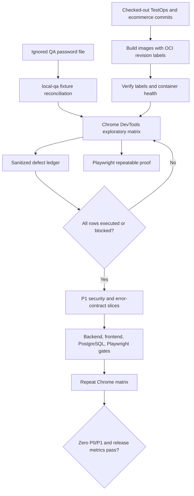
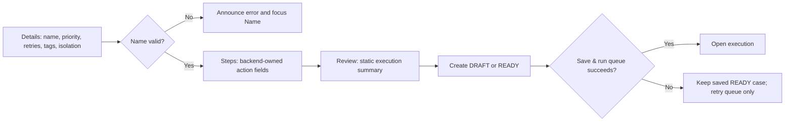

# Full-system quality-gate workflow

The important boundary is the first decision: exploratory evidence is completed and triaged before product fixes. Each later repair gets a focused regression test, updated documentation, a scoped commit, a push, and green CI before the next slice.

## Guided authoring repair path

Server paths such as `steps[2].locatorRole` are translated to the stable client ID of the corresponding editable row. Reordering therefore cannot make a backend violation appear on a different step.
