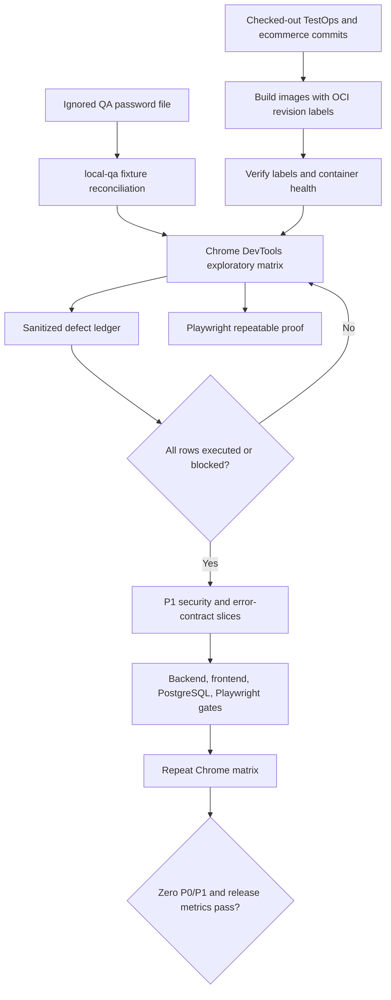
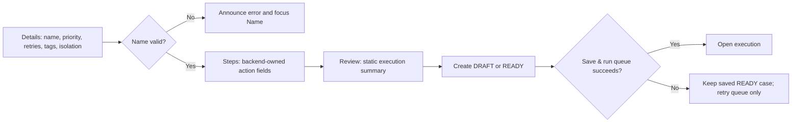
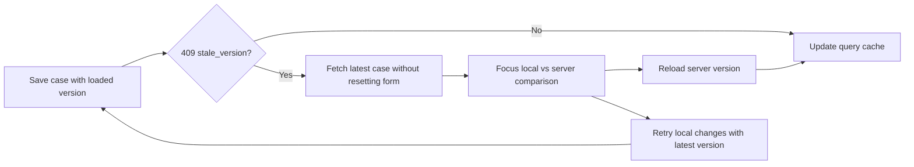
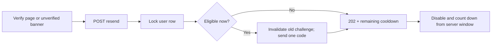
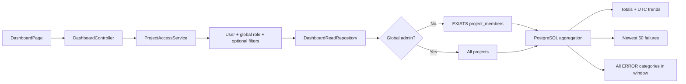

# Full-system quality-gate workflow

The important boundary is the first decision: exploratory evidence is completed and triaged before product fixes. Each later repair gets a focused regression test, updated documentation, a scoped commit, a push, and green CI before the next slice.

## Guided authoring repair path

Server paths such as `steps[2].locatorRole` are translated to the stable client ID of the corresponding editable row. Reordering therefore cannot make a backend violation appear on a different step.

## Stale-version recovery

The comparison intentionally summarizes step actions instead of repeating locator and input values. The user's local editor remains intact until one recovery button is chosen.

## Verification resend path

Unknown public addresses follow the same generic `202` response shape without creating a challenge. The QA overlay routes the one eligible message to Mailpit; simultaneous cooldown requests do not increase its message count.

## Dashboard reporting path

Recent failure cards and infrastructure categories deliberately have different bounds. Cards are a 50-row diagnostic preview; categories are a complete aggregate for the requested half-open UTC window. Both are tenant-scoped before PostgreSQL returns data.

The repeatable database proof is `scripts/verify-dashboard-postgres.ps1`. It creates a disposable PostgreSQL container on a Docker-selected loopback port, passes its connection through `TEST_DATABASE_*`, runs the complete `ApplicationContextIT`, and stops only that generated container. CI continues to use Testcontainers automatically when no external URL is supplied.
