# Full-system quality-gate workflow

## Current isolated candidate flow

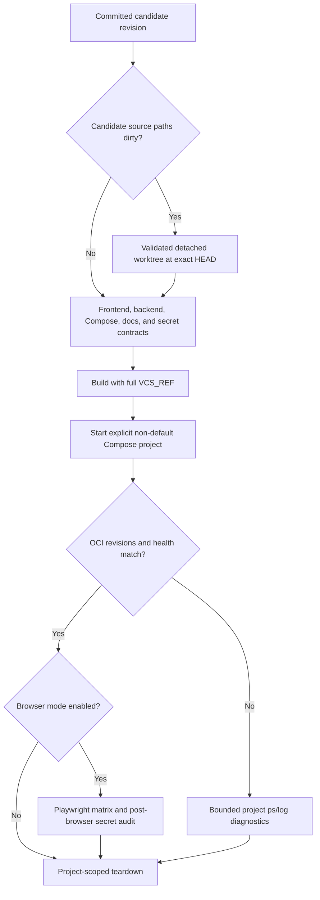

The aggregate entry point is `scripts/verify.ps1 -ProjectName <isolated>`.
`-NoBrowser` removes published ports but retains image, startup, health, and
revision proof. Cleanup always receives the same explicit project name and
Compose file list; the developer's default project is outside the gate's
mutation boundary.

## Historical full-system workflow

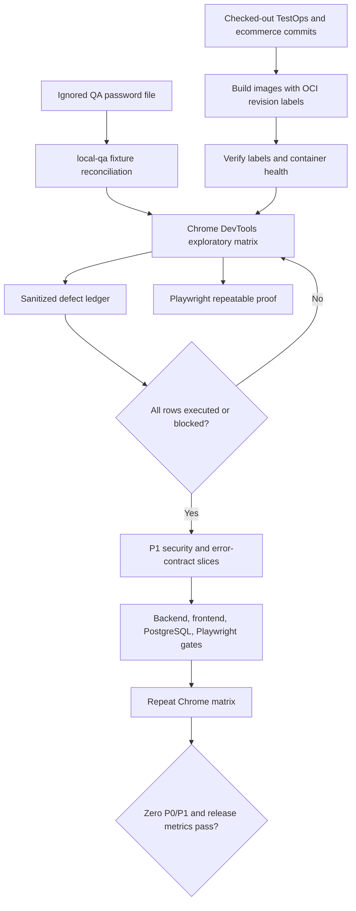

The important boundary is the first decision: exploratory evidence is completed and triaged before product fixes. Each later repair gets a focused regression test, updated documentation, a scoped commit, a push, and green CI before the next slice.

## Guided authoring repair path

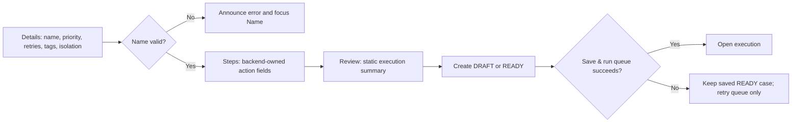

Server paths such as `steps[2].locatorRole` are translated to the stable client ID of the corresponding editable row. Reordering therefore cannot make a backend violation appear on a different step.

## Stale-version recovery

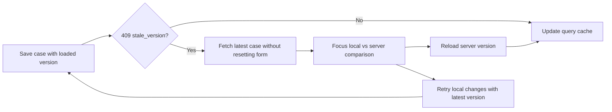

The comparison intentionally summarizes step actions instead of repeating locator and input values. The user's local editor remains intact until one recovery button is chosen.

## Phase 9 browser-quality flow

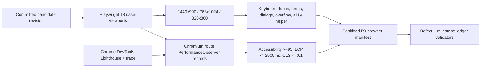

The DevTools capture is a public readiness anchor at desktop and narrow
mobile; authenticated routes use the sanitized Chromium matrix. This keeps
the evidence revision-matched without serializing cookies, tokens, or raw
browser payloads.

## Verification resend path

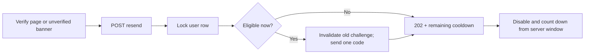

Unknown public addresses follow the same generic `202` response shape without creating a challenge. The QA overlay routes the one eligible message to Mailpit; simultaneous cooldown requests do not increase its message count.

## Dashboard reporting path

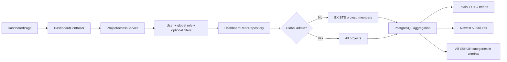

Recent failure cards and infrastructure categories deliberately have different bounds. Cards are a 50-row diagnostic preview; categories are a complete aggregate for the requested half-open UTC window. Both are tenant-scoped before PostgreSQL returns data.

The repeatable database proof is `scripts/verify-dashboard-postgres.ps1`. It creates a disposable PostgreSQL container on a Docker-selected loopback port, passes its connection through `TEST_DATABASE_*`, runs the complete `ApplicationContextIT`, and stops only that generated container. CI continues to use Testcontainers automatically when no external URL is supplied.

## Project permission decision

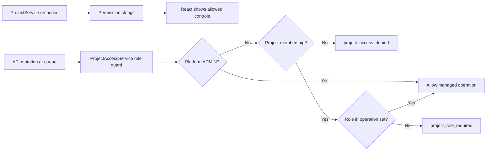

The response and guard are tested separately. A visible frontend control never substitutes for the backend decision, and a backend denial should not be hidden behind a generic client error.

## Scoped identifier and cancellation path

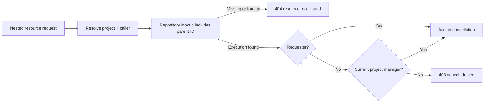

Membership demotion/removal uses the same project-scoped lookup. A write targeting the final project manager stops with `409 final_project_manager` before mutation or audit persistence.

The disposable PostgreSQL gate follows a successful two-manager demotion with final-manager, stale-version, and archived-project attempts. Every rejected write is re-read from PostgreSQL to prove the membership row and manager role remain intact.

## Member-management UI path

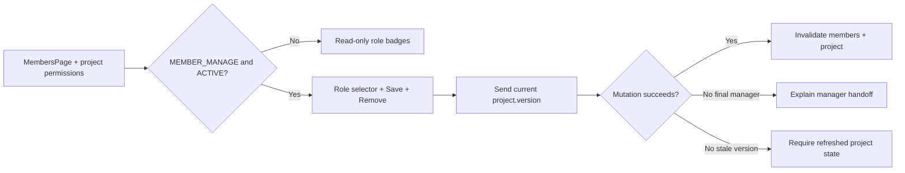

## Positive membership lifecycle path

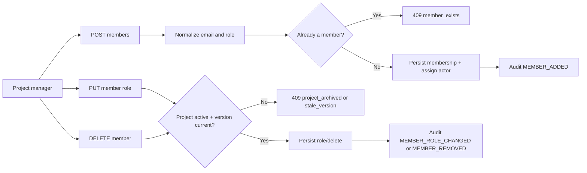

The focused positive lifecycle regression is documented in [membership positive lifecycle](../testing/37-membership-positive-lifecycle.md). Its MockMvc assertions prove `201` add, `200` role change, `204` removal, and structured duplicate conflicts. Chrome DevTools then verifies the same boundary for project manager, test manager, tester, viewer, non-member, and administrator journeys.

## Phase 5 role and tenant browser path

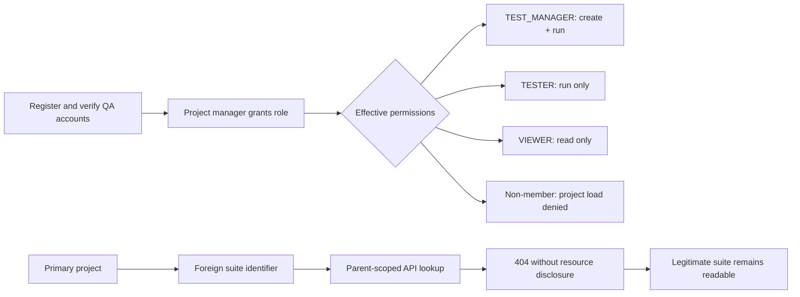

The repeatable browser proof for this path is [`phase5-role-tenant-browser-evidence.md`](../testing/40-phase5-role-tenant-browser-evidence.md) and [`phase5-role-matrix.spec.ts`](../../frontend/e2e/phase5-role-matrix.spec.ts). Each account keeps its authenticated SPA context while the test uses semantic navigation; this avoids coupling the test to the frontend's in-memory access-token implementation. A foreign suite ID is asserted at the network boundary as `404`, then the UI's non-disclosing error state and the legitimate suite are both checked.

## Definition Trash and restore path

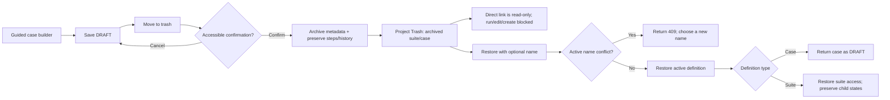

The browser proof for this path is captured in [definition lifecycle browser evidence](../testing/38-definition-lifecycle-browser-evidence.md). A newly authored QA-owned draft was saved, archived with a focused modal, observed in the project Trash list, restored through the name-aware dialog, and found again under the active suite as `DRAFT`. The lifecycle requests returned `201` for creation and `200` for archive/list/restore, with no console messages. The repeatable E2E equivalent is `frontend/e2e/definition-lifecycle.spec.ts`, which runs against the isolated target-site profile. Archived definitions retain execution history but cannot be mutated or queued.

Project archive and restore follow the same safe mutation boundary. The UI sends the loaded project version in `If-Match`; the backend rejects missing or stale versions and repeated state transitions with structured problems. See [project lifecycle version evidence](../testing/39-project-lifecycle-version-evidence.md).

## Phase 5 authentication, return, and session path

```mermaid
flowchart LR
    DeepLink[Anonymous protected deep link] --> Login[/login?returnTo=...]
    Login --> Credentials{Password accepted?}
    Credentials -->|No| Invalid[Structured login error]
    Credentials -->|Yes| Verified{Email verified?}
    Verified -->|No| Verify[/verify-email?email=...&returnTo=...]
    Verify --> Code{OTP valid and active?}
    Code -->|No| CodeError[Inline invalid/expired error]
    Code -->|Yes| Destination[Return to sanitized destination]
    Destination --> Account[Account: list active sessions]
    Account --> Revoke[Revoke one family -> 204 -> refetch]
    Account --> RevokeAll[Revoke all -> invalidate tokens -> login]
```

The return value is always a same-origin relative path. `returnTo.ts` rejects absolute, protocol-relative, and backslash-containing values before React Router navigates. `SessionController` lists only active refresh-token families for the authenticated subject, checks ownership before individual revocation, and returns `204` for empty successful writes so the shared `apiFetch` helper can complete and React Query can refetch. The repeatable proof is [Phase 5 auth/session browser evidence](../testing/41-phase5-auth-session-browser-evidence.md) and `frontend/e2e/phase5-auth-session-matrix.spec.ts`. Expiry, recovery, Google, administrator, execution, and accessibility/performance paths remain separate gate rows.
